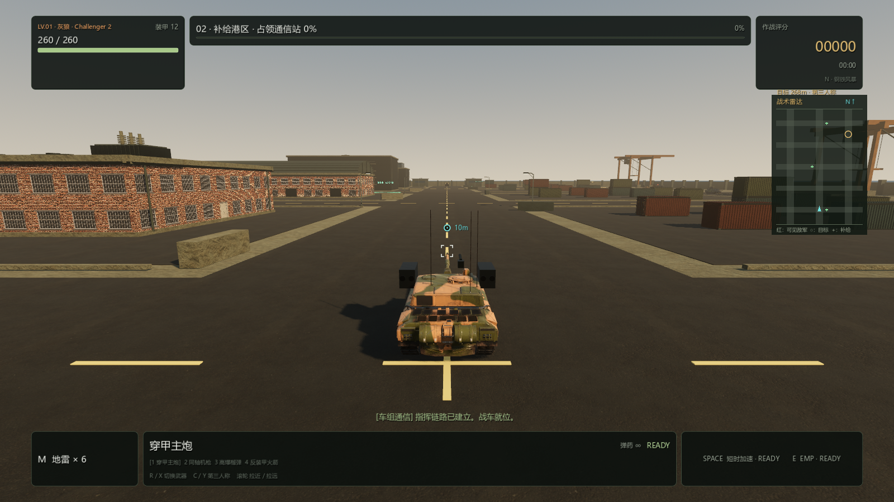
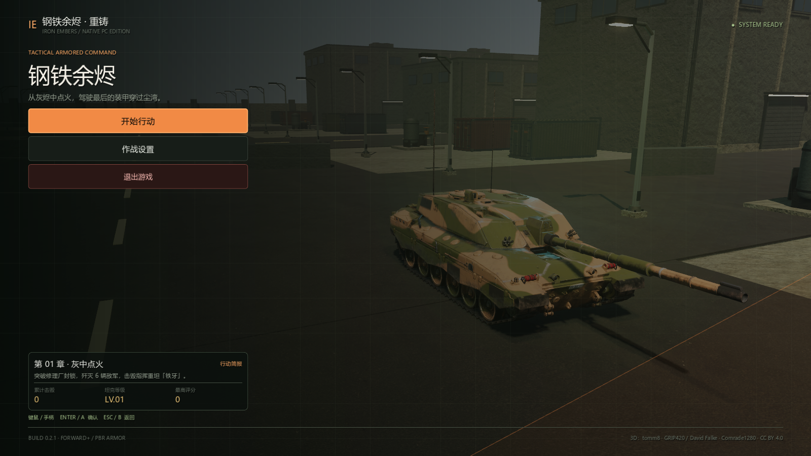
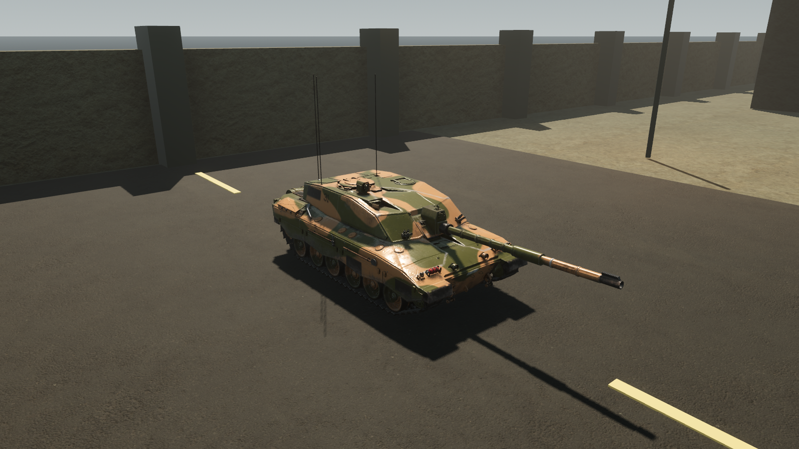

# 钢铁余烬 · IRON EMBERS

## 🎮 [点击立即试玩网页版 →](https://zcxcn.github.io/tankbattle/)

**试玩地址：[zcxcn.github.io/tankbattle](https://zcxcn.github.io/tankbattle/)**

无需安装，打开浏览器即可开战。支持键鼠和手柄。

---

项目同时包含使用 Godot 制作的 Windows PC 原生重制版，以及使用 **Babylon.js 9.25** 的网页版 3D 坦克动作游戏。网页版原有代码、部署方式和 Android 基线继续保留。

## Godot PC 原生重制

`pc-godot/` 是用 **Godot 4.7.2、Forward+ 和 Jolt Physics** 制作的 Windows / macOS 原生坦克游戏。PC **0.4.12** 提供六关连续战役，每张地图 **288 × 384 米**：工业外围、补给港区、指挥堡垒、钢厂反击、港口封锁和最后壁垒，分别执行肃清、占领或摧毁任务，然后迎战各关首领。普通敌车逐关增加到 **6 / 9 / 12 / 15 / 18 / 22 辆**，装甲、火力和装填能力逐步增强；通关解锁、整备补给和重玩奖励均独立结算。

**0.4.12 敌车主动追击。** 初始观察距离调整为 70–125 米；发现玩家后利用装填间隙接近，保留停车瞄准和远距离交战。已发现的可见目标可跟踪至 120–220 米，建筑遮挡仍有效；失去目标后搜索最后位置，16 秒未找回则恢复巡逻。[0.4.12 追击与实弹自检](docs/pc-realistic/SELF_CHECK_0.4.12.md)。

**0.4.11 敌车远距离交战。** 敌车索敌扩大到 120–220 米（按车型区分），装填就绪后可直接停车稳定瞄准远方可见目标，不必先开到近处。侧置敌方火箭筒修正远距离水平偏差；建筑遮挡、瞄准预备、原有射速与伤害继续保留。[0.4.11 自检与实弹验证](docs/pc-realistic/SELF_CHECK_0.4.11.md)。

**0.4.10 巨怪追击与性能优化。** 新下载吞噬恶魔、岩石魔像两套带贴图骨骼模型，增加 34 米深渊吞噬者、52 米裂岩巨像和每四波出现的 72 米断岳巨神，共九类怪物、五套原始模型。怪物移速约提高 85%，发现玩家或受到攻击后会主动追击，重击保留蓄力和躲避窗口。扩大备用入场区域、缩短补兵间隔，验证第一波清场及暂停恢复后的自然续波。缓存死亡骨骼数据、减少重复感知和隐藏菜单更新，保留画质配置。[0.4.10 自检、性能数据与截图](docs/pc-realistic/SELF_CHECK_0.4.10.md)。

**0.4.9 巨兽扩展与续波修复。** 无尽模式现有六类怪物：14 米腐化巨尸、22 米枯林岩魔、24 米暴虐巨尸、30 米裂脊猎兽、42 米灾厄泰坦、60 米灭城巨蜥，使用三套不同的带纹理骨骼模型。第二波加入灭城巨蜥，每五波再次出现；每三波加入泰坦。新增岩魔和爬行巨兽保留原作网格、UV 与法线，爬行巨兽另有长尾、背甲和行走动作。清空在场怪物及本波待入场队列后，最多等待 6 秒进入下一波；未清场仍按 65 秒持续增援，HUD 显示在场数量、待入场数量与下波倒计时。无尽第三人称支持向上观察高楼级目标。[0.4.9 自检与截图](docs/pc-realistic/SELF_CHECK_0.4.9.md)。

**0.4.8 新模式：无尽防守 · 巨兽围城。** 从主菜单进入，在独立的城市大道上守住避难所；巨型恐怖生物持续从三条路线逼近，波次每 65 秒推进，每三波加入巨型精英。怪物具有纹理皮肤、骨骼行走、攻击预备和倒地过程，接近时出现沉重脚步与距离衰减震动。防线或坦克被摧毁即结束本局。击杀获得战利品，按 **Esc / 手柄 Start** 暂停并购买弹头强化、自动装填、基地加固、维修或弹药。四种武器均可升级；地雷伤害与 EMP 踉跄同样作用于巨怪。局内成长重新开局时重置，最高波数、击杀和生存时间独立保存，不消耗或解锁战役进度。模式默认第三人称，**C / Y** 可切回俯视，远程桌面继续使用 **F8**。[无尽模式自检与实际截图](docs/pc-realistic/SELF_CHECK_0.4.8.md)。

0.4.7 把平坦厂区扩展为城市河谷战场：战区加入约 38–70 米的退台办公楼、住宅高层与市政塔楼，配有倒角外壳、玻璃窗、阳台、入口雨棚和屋顶设备，外围还有十栋天际线建筑。28 米宽的河道穿过地图，三座带实体桥面、护栏、桥墩和钢拱的桥连接主干道；河水低于路面，具有流动细浪与岸线泡沫。东南街区替换为可驾驶的起伏山丘，远处增加山岭和草地平原。实拍岩石、现代混凝土立面、草地与泥石 PBR 使用 Poly Haven CC0 资源，完整原始素材约 5.95 MB。雨雪落地高度、积水、屋顶遮挡和桥梁通行均已适配；[地形与城市自检](docs/pc-realistic/SELF_CHECK_0.4.7.md)记录实际物理验证和渲染截图。

主菜单可选择 KF51、Challenger 2 和 KV-2 三种授权写实 PBR 底盘，分别偏重机动、均衡和重装甲。敌军扩展为 **11 种作战角色**：原有侦察、主战、重装、远射、机枪和火箭车，加上巡护、突击、榴弹、抢修和重型歼击车。它们共用三种原始车体，具有不同装备外观和实际行为；抢修车消耗有限维修储备修复附近可见友军；原布雷车改为主炮巡护车，敌人和 Boss 均不再具备布雷能力。单车原始模型为 63,016–176,035 三角面，保留完整 PBR 材质、独立炮塔与炮管。作者与许可见 [`资产来源`](pc-godot/assets/THIRD_PARTY_ASSETS.md)。

地雷仅由玩家布设：经过 1.2 秒布防后触发，只攻击敌对车辆，90 秒后失效。玩家的电磁脉冲可安全排除范围内地雷，并短暂瘫痪敌军、打断 Boss 攻击准备。敌军的巡逻、交火与公共布雷入口均已移除或拒绝该能力。

三种车型的实际负重轮按车速和转向差速转动，停车时停止；共享拆分后的网格并保留原始 PBR 材质。当前履带链条仍为静态网格。贴图使用 PC 显存压缩，第三方模型署名与许可随 Windows 成品一同打包在 `credits/` 中。

保留从容的装甲交战节奏：均衡型坦克移速 8 米/秒、主炮装填 2.9 秒；车体和炮塔转动有速度限制，转弯降速，空格提供 1.35 倍短时加速。四种武器随时切换：穿甲主炮、40 发弹链机枪（240 发备弹、换带 4.4 秒）、24 发高爆榴弹、8 发反装甲火箭。穿甲弹与榴弹共用炮膛，切枪不能跳过装填；绿色整备点一次性修复 85 点装甲并补满弹药、地雷。

每次行动从全图 **175 个道路安全候选位置**随机部署敌军，保留出生安全距离和车辆间距，巡逻路线避开建筑与任务燃料库。敌军通过距离、视角和实体遮挡发现玩家，停稳瞄准后开火；失去视线时搜索最后看到的位置，随后恢复巡逻。机枪敌车短点射后停歇，EMP 会打断瞄准。Boss 前补给把装甲恢复至至少 75% 并重置 EMP；每关 Boss 在 70% / 35% 装甲阶段强化攻击，火箭齐射具有预警、锁定位置和发射后休止，可侧移躲避或用 EMP 打断。

按 **C** 在俯视与真正的第三人称跟随视角之间切换，滚轮可调距离，俯视拉近后自动进入第三人称。近景鼠标/右摇杆控制观察与瞄准，移动方向随镜头旋转，SpringArm 自动避免镜头穿墙。炮管具有真实俯仰和机械限位，白色角标表示瞄准意图，圆形准星预测当前炮口的实际弹道落点。雷达保持朝北，显示视线内近处敌军、任务目标、补给和附近地雷。

0.4.6 增加远程桌面鼠标兼容：按 **F8**，或在设置中把“第三人称鼠标”切成“远程桌面”。该模式使用绝对鼠标位置，移动鼠标会移动目标准星，停在画面边缘可持续转动视角，无需捕获或反复居中鼠标。中央区域可以精细瞄准，俯视继续沿用原操作。暂停、切换模式和恢复时清除旧的边缘转向状态；右摇杆接管后恢复中心瞄准，再次移动鼠标可切回。偏好在本机保存，默认仍为本地模式；本地第三人称为中心准星、鼠标转视角。

第三人称鼠标输入接收原始屏幕位移，兼容只提供相对位移的输入，并保留细微瞄准；切换视角和暂停恢复时立即同步鼠标捕获。0.4.4 为定向炮口焰补充迎向镜头的高温火团，第三人称沿炮管方向也能看清，热焰持续约 0.25 秒，照亮炮塔与路面；战场特效满额时优先保留玩家开炮。炮管在 85 毫秒内回退，短暂停留后用约 0.70 秒复位，均衡车型峰值退程约 0.65 米，同时加强悬挂摇动和镜头冲击。关闭屏幕震动会立即清除镜头后坐，炮管机械动作仍保留。

自己的主炮、机枪和火箭使用独立保留的武器声道，拉远镜头不会压低本车炮声，敌方音效也不能占掉玩家的发射声。实录炮声保留爆发瞬态与户外余响，开炮时短暂压低发动机和远处战斗声音，最终输出限制峰值；音效与总音量设置仍然生效。

0.4.5 加强被击中的反馈：主炮撞击装甲出现白热闪光、短促流体火团、外抛金属火星和碎屑；榴弹与火箭产生更大的爆燃和压力尘浪，机枪为连续短火星。玩家受击优先获得命中特效及独立录音声道，重击叠加钢铁冲击与低频闷爆。镜头按命中方向抬动、侧倾和衰减振荡，约半秒恢复，手柄受击震动也更强。直击与同帧溅射合并为一次反馈，原有伤害分别结算；暂停冻结，屏幕震动关闭时保留声音和外部火光。

标准手柄支持任意设备编号和重连，左右摇杆分别移动、瞄准，RT 开火、LT 精瞄、X 换武器、Y 换视角；十字键上下变焦、左切 BGM、右换武器。菜单支持摇杆/十字键、A 确认、B 返回、START 暂停。HUD 自动切换操作提示；使用中的手柄断开会清除残留输入并暂停。射击和受击向支持震动的手柄发送不同强度反馈。自动化覆盖非 0 号设备的完整输入流程，本机没有实体手柄，尚未完成实体手柄兼容性实测。

六关采用三类工业街区的不同光照和战斗配置。下载并整合 Poly Haven CC0 工厂模块，加入有立体窗框、门洞和装卸口的砖墙外立面；七类建筑包括装卸仓库、烟囱工厂、办公楼、公寓、拱顶机库、变电站和维修车库，并保留油罐、集装箱、龙门吊和观察塔。使用实际 Jolt 空间验证道路及出生净空，门窗合批、共享网格和 LOD，175 米外停止绘制细小立面。

炮弹改为四种封闭 GLB 模型，具备弧形弹头、铜制弹带、引信和火箭尾翼，飞行中使用实际尺寸。玩家 AP / 机枪 / HE / 火箭速度分别为 **260 / 500 / 185 / 95 米/秒**，连续扫掠检测避免高速穿墙；AP、HE 和机枪受重力影响，机枪间隔出现紧凑曳光，火箭保留短烟尾。HE 伤害半径 **8 米**、火箭 **6 米**。爆炸采用 Unity Labs 公开的 CC0 Houdini 流体模拟动画序列，在 Godot 内插值播放；火团快速膨胀冷却、黑烟翻卷上升，贴地尘浪逐渐减速，火星与碎片按抛物线回落。

坦克击毁后保留原车模型与碰撞，呈现发动机起火、炮塔环断裂或弹药舱喷火三种残骸；**25% 概率在 3.3–7.2 秒后殉爆**，多股短促火团向上喷发，随后冷却成翻卷黑烟，伴随灼热碎片和炮塔抛飞，9 米内双方车辆可能受伤，建筑可以遮挡。最多保留十四辆残骸、六处持续燃烧，27 秒后熄火；暂停冻结危险计时，换关清理。

天气默认**随机**，每次出击从晴天、小雨、大雨、雪天和雾天中选择。作战设置可以固定天气并立即切换，保留当前战斗和车辙；偏好在本机保存。雨景包括阴云、湿路面、积水、涟漪和原创雨声；雪花缓降、随风摆动，地面与屋顶有局部薄雪；雾天降低远景对比。雨雪在玩家附近有限范围绘制，屋顶高度纹理提供遮挡，暂停冻结。

玩家和敌军行驶时留下双条履带印，沿真实地面投影，支持倒车、差速转弯和缓坡；停止、离地或传送不会拖出不合理印迹。按画质限制 128 / 256 / 448 / 640 段，玩家印迹保留独立配额，旧痕渐隐，换关清理；雨天颜色更深、消退更快。

按 **N** 切换三首原创循环 BGM，设置中可分别调整音乐、战斗音效和通信音量。通信改用 Kenney CC0 语音包中男女演员的 **13 段英文真人录音**，保留自然语调，中文字幕对应实际台词；开局为简短的 **Ready／准备就绪**。弹药不足、弹药耗尽、装甲补给和排雷四项没有对应真人台词，使用准确状态字幕与轻提示音。播报保留优先级、限频和暂停处理，人声期间音乐自动降低。实录发动机、履带拟音、转向摩擦和碰撞声根据实际运动变化，停车、暂停或摧毁时正确停止。完整许可及制作方式见 [`战斗录音`](pc-godot/assets/audio/combat/README.md) 和 [`音乐与战场通信`](pc-godot/assets/audio/battlefield/README.md)。

[0.4.6 远程桌面鼠标自检](docs/pc-realistic/SELF_CHECK_0.4.6.md) · [0.4.5 装甲受击与声音震动自检](docs/pc-realistic/SELF_CHECK_0.4.5.md) · [0.4.4 炮声、炮口火焰与后坐自检](docs/pc-realistic/SELF_CHECK_0.4.4.md) · [0.4.3 真人语音、流体烟火与可选天气自检](docs/pc-realistic/SELF_CHECK_0.4.3.md) · [0.4.2 雨景、车辙与殉爆自检](docs/pc-realistic/SELF_CHECK_0.4.2.md) · [0.4.1 鼠标、炮口效果、后坐力与手柄自检](docs/pc-realistic/SELF_CHECK_0.4.1.md)

Godot PC 实际渲染截图（Challenger 2：tomm8，CC BY 4.0；完整来源见上方资产说明）：



[0.4.0 实体弹药](docs/pc-realistic/ordnance-0.4.0.png) · [燃烧残骸与炮塔殉爆](docs/pc-realistic/cookoff-0.4.0.png) · [建筑近景](docs/pc-realistic/buildings-0.4.0.png) · [六关战役自检与显卡性能数据](docs/pc-realistic/SELF_CHECK_0.4.0.md)




[0.2.1 战斗准星与雷达](docs/pc-realistic/battle.png) · [工业街区细节](docs/pc-realistic/industrial-street.png) · [烟尘效果](docs/pc-realistic/smoke.png)

[0.2.2 战斗视野与敌车反馈](docs/pc-realistic/tactical-battle-0.2.2.png) · [战斗节奏对照与 271 项自检](docs/pc-realistic/SELF_CHECK_0.2.2.md)

键鼠和标准手柄操作：

| 操作 | 键鼠 | 标准手柄 |
| --- | --- | --- |
| 移动 | WASD / 方向键 | 左摇杆 |
| 瞄准 | 鼠标 | 右摇杆 |
| 开火 | 鼠标左键 | RT |
| 选择主炮 / 机枪 / 榴弹 / 火箭 | 1 / 2 / 3 / 4 | — |
| 轮换武器 | R | X / 十字键右 |
| 第三人称精瞄 | — | 按住 LT |
| 切换战斗音乐 | N / 设置菜单 | 十字键左 / 设置菜单 |
| 短时加速 | 空格 | LB |
| 电磁脉冲 / 排雷 | E | RB |
| 布设地雷 | M | 右摇杆按下（R3） |
| 俯视 / 第三人称 | C | Y |
| 本地 / 远程桌面鼠标 | F8 / 设置菜单 | 设置菜单 |
| 拉近 / 拉远镜头 | 鼠标滚轮 | 十字键上 / 下 |
| 菜单选择 / 确认 / 返回 | 方向键 / Enter / Esc | 摇杆或十字键 / A / B |
| 暂停 | Esc | Start |
| 全屏切换 | F11 | — |

本地已准备官方 Godot 4.7.2 Standard x86_64 和 Windows 导出模板时，可在 PowerShell 7 中运行：

```powershell
$godot = (Resolve-Path .\work\tools\godot-4.7.2\editor\Godot_v4.7.2-stable_win64_console.exe).Path
& $godot --editor --path .\pc-godot
& $godot --path .\pc-godot

# 独立逻辑测试与真实场景集成测试
& $godot --headless --path .\pc-godot --script res://tests/test_runner.gd -- --test
& $godot --headless --path .\pc-godot res://tests/integration_scene.tscn -- --test
& $godot --headless --path .\pc-godot --script res://tests/tracked_drive_test.gd -- --test

# 导入资源、运行测试、导出并启动成品冒烟检查
pwsh -NoProfile -File .\scripts\build-pc-godot.ps1 -Configuration Release
```

构建脚本固定校验官方 Godot 可执行文件和模板的 SHA-256；其他位置的同版 console 程序可通过 `-GodotPath <路径>` 指定，Windows 模板仍放在 `work/tools/godot-4.7.2/templates/`。Release 成品位于 `outputs/pc-godot/windows-x86_64/`，可分发压缩包为 `outputs/pc-godot/Iron-Embers-Windows-x86_64-0.4.12.zip`。解压后双击 `IronEmbers.exe`，保留同目录 `IronEmbers.pck` 和 `credits/` 即可离线运行。当前 Windows 可执行文件未做代码签名，首次运行可能显示系统信誉提示。

本次 PC 重制的源码集中在 `pc-godot/`，构建与验收脚本为 `scripts/build-pc-godot.ps1`、`scripts/smoke-pc-godot.ps1`；`mobile/baseline/` 和 `android/` 未改动。

**macOS 0.4.9 测试包**：`outputs/pc-godot/Iron-Embers-macOS-Universal-0.4.9.zip`，包含 Apple Silicon 原生 ARM64，适合 MacBook Pro M4。将整个 ZIP 传到 Mac 后解压，把 `IronEmbers.app` 拖到“应用程序”运行；首次未公证提示可按包内中文说明在“隐私与安全性”允许。可运行 `pwsh -File scripts/build-pc-macos.ps1` 重新导出；[Mac 导出流程与检查说明](docs/pc-realistic/MACOS_EXPORT_0.4.8.md)介绍签名、权限、资源验证及尚未完成的 M4 实机测试。

## 2026-09 网页战斗升级

按 image2 绘制了三张新的材质贴图：磨损喷漆装甲、工业沥青路面和旧砖墙，已用于实际战场与车库。三张图均为 1254 × 1254，网页 WebP 合计约 1.24 MiB；完整提示词和生成记录见 [贴图说明](web/assets/generated/README.md)。装甲继续保留各车型配色，窗户、道路标线仍由实际几何呈现；没有混用与新图错位的旧法线贴图。其余地面、工业金属和树木材质继续使用原有资源。

炮声与弹道更新：加农炮改用三段真实坦克/火炮户外录音，保留低频爆压和约 3 秒余响；机枪、火箭、爆炸、装甲撞击、跳弹、发动机、履带和能量武器共接入 19 个音效库片段（约 3.8 MiB）。坦克发动机为实录，履带为机械拟音，科幻武器为库素材设计音效；来源、署名、许可和剪辑处理见 [Audio credits](web/audio/combat/README.md)，游戏设置内也有入口。资源随网页部署，首次进入战场缓存解码；下载失败使用合成后备，不补播迟到的炮声。暂停会停止单次音效，战斗声音在英文电台播报期间自动压低。

普通炮弹改为紧凑金属弹体和短曳光，机枪约每 4 发出现一次曳光；火箭沿实际转向路径留下扩散烟迹。所有弹体位置和命中仍与战斗模拟一致，低帧率也不会拉成长激光；未额外模拟重力下坠或改变命中规则。

实玩排查修复：胜败发生时立即同步最终 HUD，避免战败动画仍显示剩余装甲；暂停与结算弹窗恢复空格按钮操作，战斗快捷键不再穿透弹窗。建筑细节改为直接生成合并几何，保留原有网格、顶点和碰撞；同机首关场景构建测试中，标准档约 3.96 → 1.47 秒、省电档约 2.76 → 0.60 秒（只含场景构建，不含下载与 GPU 初始化）。`npm test` 已纳入真实帧循环和键盘处理的回归检查。

网页版封面现为生成的写实工业战场图，车库继续展示实际可玩的 3D 坦克。车体、炮塔和炮盾增加倒角，履带改为闭合绕轮结构，补充轮毂、散热百叶、观察窗、车灯护栏和拖曳钢缆。地图新增凹窗、窗台、坡屋顶、排水设施和有支撑的屋顶设备；树木采用分层枝叶。日光与泛光重新调整，让材质和装甲轮廓更清晰。

此前整理的 6 套 Poly Haven CC0 实拍 PBR 材质仍保留在仓库中；本次道路、装甲和砖墙改用上方生成贴图，网页仅打包当前实际引用的资源。实拍材质来源、作者和许可见 [材质说明](web/assets/surfaces/README.md)，封面生成方式见 [封面说明](web/assets/COVER.md)。这些资源通过带哈希的网页模块加载，Android 与 PC 版本均保持原样。

新增坦克柴油怠速、钢制履带敲击与摩擦声，车速和转向由实际移动驱动；撞墙时不会保持全速履带声。英文中控电台提供 21 条播报，覆盖接敌、击毁、Boss 阶段与齐射、装甲告急与修复、地雷与脉冲、弹药、目标和胜负。短电台接通音、窄频语音和收尾杂音均已打包；播报期间自动压低音乐与战斗音量。警报按优先级、冷却和有效期播放，暂停、静音、后台和退出会停止播报。音效开关同时控制履带与电台，音乐仍可单独调整。

英文播报 WAV 约 2 MB，通过网页模块导入，Android 不包含它们。语音由本地 Windows 英文 Zira 合成，再应用原创电台处理；无需在线语音服务，未使用红警原声音频。`npm run test:audio` 检查音频循环、触发与中断逻辑、资源完整性。需要重新生成时，在装有 Zira、Node 和 Python 的 Windows 上执行 `powershell -NoProfile -ExecutionPolicy Bypass -File scripts/generate-radio.ps1`。

本轮仅升级网页版（Vinext 与 GitHub Pages）。Android 使用 `mobile/baseline/` 中升级前的游戏代码；`mobile/main.tsx` 和移动构建别名指向该基线，构建时检查依赖图，禁止混入网页新代码。Android 原生工程、贴图、音乐和 APK 未更新。`scripts/verify-android-baseline.mjs` 校验冻结源码、原生工程和原有资源的 SHA-256。

- 每一关都有具名 Boss，必须同时完成原任务与击毁 Boss 才能通关。普通关 Boss 随章节增强，原第 6/12/18 关为强化首领；70% / 35% 生命时切换榴弹 / 火箭齐射并呼叫护卫。蓄力期间停止移动、锁定炮口，红色瞄准线提示危险方向，脉冲可中断蓄力。
- 敌军增加有限的移动提前瞄准、射程内侧移、远程车型近距离后撤与布雷，保留道路寻路、出生距离和掩体碰撞。
- **M / 手柄右摇杆按下（R3）/ 布设地雷按钮**：在车尾布雷，初始 6 枚，冷却 2 秒，1.2 秒后就绪，90 秒后失效。每击毁 3 辆补充 1 枚，库存最多 8 枚，每辆车最多同时布设 8 枚，全场最多 32 枚。
- 双方地雷只由敌对车辆触发，范围爆炸被完整墙体阻挡；玩家地雷击毁正常计入成长。雷达与实体光环用青色标记我方、红色标记敌方。**E 脉冲**安全移除 300 范围内双方地雷，不引爆；原有敌军瘫痪半径为 280。
- 程序装甲模型新增履带绕轮、拖车耳、炮塔附加装甲、储物箱、焊缝、泥痕、炮管抽烟器、护套箍环及空心炮口。涂漆装甲采用更低金属度、更高粗糙度和共享微表面法线，保留等级进化与七种主炮。无需下载外部模型。
- 爆炸采用短闪光、快速冷却的火球、有体积明暗的烟柱、不规则尘浪、贴地尘团和冷却碎片，继续使用固定容量对象池与共享灯光。
- 七种武器优先使用上方音效库；保留原创气压冲击、多频段爆裂与机械回位合成作为离线加载失败的后备，后备加农炮也增加低频和余响。音源有缓存、并发限制和暂停清理。

网页版开发：`npm run dev:web`；静态交付：`npm run build:pages`（输出 `outputs/github-pages/`）。`npm test` 包括原有战斗、3D、音乐检查，新增网页专项测试及 Android 基线校验；不等同于真实 GPU、扬声器、全关卡人工通关或长时间性能验收。

## 启动

需要 Node.js 22.13 或更新版本。

```sh
npm install
npm run dev
```

打开终端打印的本地地址（默认 `http://localhost:3000`；被占用时会使用下一个端口）。

```sh
npm run build       # 生产构建
npm test            # 战斗模拟 + Babylon.js 3D 集成检查
npm run test:3d     # 单独运行 3D 引擎集成检查
npm exec tsc -- --noEmit
```

## GitHub Pages

源码仓库：https://github.com/zcxcn/tankbattle

公开游戏地址：https://zcxcn.github.io/tankbattle/

GitHub Pages 使用独立的纯静态 React / Vite 入口，不需要服务端。默认部署路径为 `/tankbattle/`，与个人网站的其他页面并存。图片、环境贴图、准星、音乐和延迟加载脚本都使用该路径；本地 Studio 和 Android 构建继续使用原来的根路径。

```sh
npm run dev:web       # 本地测试静态版本，访问终端所示地址的 /tankbattle/
npm run build:pages   # 构建并检查静态文件，输出 outputs/github-pages/
npm run preview:pages # 预览构建结果
```

发布时将 `outputs/github-pages/` 内全部文件同步到 `zcxcn/zcxcn.github.io` 仓库的 `tankbattle/` 目录并提交。保留个人网站已有的 Jekyll 配置和其他目录。每次更新需重新构建；浏览器中的成长记录按域名保存，本地与 GitHub Pages 的记录不会自动迁移。

## Android 横屏版

以下安装与真机记录对应已有 APK；本次网页版的背景音乐、武器切换、边界与视觉升级尚未重新打包到该 APK。

安装包：`outputs/android/iron-embers-android.apk`。将 APK 传到手机，在文件管理器中点开安装。Android 8.0 及以上，依赖系统自带的现代 Android System WebView；完整游戏、18 关和贴图都装在 APK 内，可离线运行，不申请网络、蓝牙扫描或存储权限。手柄和鼠标在手机系统设置中配对，或通过 USB / OTG 连接，连接后按任意手柄键激活。

原生 Activity 使用 `sensorLandscape` 支持左右横屏、沉浸模式和显示切口；系统返回键打开暂停，结算可直接点击重试/回到指挥中心。弹窗与游戏处于同一全屏页面。左摇杆移动，右摇杆拖动瞄准并开火，自动瞄准按钮只选择视线未被建筑阻挡的敌军；接鼠标后可用鼠标瞄准射击、左触屏摇杆移动，或用标准手柄完成菜单及战斗。

红米 K80 默认采用省电画质 / 30 FPS，设置可选 45 / 60 FPS，进入下一场战斗生效。此默认策略也用于其他触屏手机，旧战役存档和等级保持。原生窗口向系统请求 60 Hz 刷新率，是否采用由系统决定。45 FPS 在 60 Hz 屏幕模式下帧间隔会交替，30 / 60 FPS 的节奏更均匀。

减少负载的实现：

- 固定 60 Hz 战斗模拟独立于 30 / 45 / 60 FPS 渲染；用截止时间限帧，避免高刷新屏幕额外绘制。
- 暂停、结算停止连续战场绘制，尺寸变化仅补绘一帧；后台清输入、暂停音频与 WebView 定时器，恢复后等待玩家继续。
- 手机省电档取消实时阴影、HDR 后处理和多重抗锯齿，保留材质内 ACES 色调映射；渲染尺寸不跟随手机高 DPR 放大。
- 768 像素装甲 / 1024 像素地面 WebP 贴图，降低纹理内存与过滤成本；主视觉也压成 WebP。
- 手机坦克减少轮毂、螺栓和履带片，保留全部七种成长形态与准确炮口；节能档最多 24 个火花、4 团烟、28 条履带印、12 个弹痕。
- 固定建筑与材质合并并冻结变换，街景按区域合并，让视锥剔除有效；钢制物体不再创建无用碎石。
- 手机车库按需绘制，停留时不持续转动；手柄未连接时降低轮询频率，菜单只在有导航输入时查询布局。
- 使用 Android 热状态与系统省电状态：中度热状态或省电模式上限 30 FPS；严重热状态上限 20 FPS，并降低分辨率和特效。降温后等待 45 秒恢复，持续掉帧另按 2 秒窗口逐级降分辨率，20 秒稳定后才上调。
- 城市 AI 复用反向路径场及通行网格，沿街区绕过整栋建筑；可破坏障碍变化时失效重建，不在每一帧给每辆坦克单独全图寻路。

已在红米 K80（Android 16）上安装并实际操作：横屏三维场景、左杆移动、右杆瞄准开火、按住自动瞄准射击、击毁升级、暂停、后台返回和结算均已运行；测试累计升至 LV.3，覆盖安装后存档保留。真机测试修复了成长条/任务提示遮挡战场、重复打开产生新页面的问题，并补充手机长按文字防选中和横屏结算布局。截图与分项记录在 `outputs/android/device-test/`、`outputs/android/verification.json`。

尚未进行真实手柄/鼠标连接、双手同时触控、持续帧率及长时间测温耗电验收。USB 供电下的电池温度快照不能作为游戏温升或续航结论，不能据此承诺不发热或稳定 60 FPS。APK 使用 release 优化（R8、资源收缩、关闭调试），用本机调试签名供本地安装；上架或长期分发前需换成自有发布签名。应用与网页分别保存本机进度，不会自动跨设备同步；卸载应用会移除应用存档。

```sh
npm run build:android:web  # 独立 Vite SPA；离线资源检查
npm run build:android      # 编译 release APK 并复制到 outputs/android/
```

构建依赖 JDK 17、Android SDK 36 / Build Tools 35.0.0、Gradle 8.14.3。脚本检测本机已有环境；其他机器可设置 `ANDROID_SDK_ROOT`、`IRON_EMBERS_JAVA_HOME`、`IRON_EMBERS_GRADLE`。首次构建需获取 Gradle/Maven 依赖；缓存齐全后可设置 `IRON_EMBERS_OFFLINE=1`。源码在 `mobile/` 和 `android/`，网页原有构建方式保留。

平台资料：[离线资源 WebViewAssetLoader](https://developer.android.com/develop/ui/views/layout/webapps/load-local-content)、[Android Thermal API](https://developer.android.com/games/optimize/adpf/thermal)、[WebView 生命周期](<https://developer.android.com/reference/android/webkit/WebView#onPause()>)。

## 3D 升级

- 网页爆炸分为装甲殉爆、燃油爆炸、范围弹着点与墙体坍塌：短促闪光、不规则火球、翻滚烟柱、贴地尘浪、抛物线碎片和柔边焦痕；一盏共享爆炸灯照亮周围装甲。效果跟随模拟时间，暂停冻结，桌面最后一击展示 0.85 秒再结算。
- 爆炸音效加入爆裂高频、低频冲击与衰减尾音，缓存噪声、限制六个并发爆炸声部并压缩总输出，避免连续殉爆堆叠失真。
- 街道两侧新增阔叶树、针叶树与绿篱，树干和绿篱使用实际碰撞并可被击毁，倒下后留下树桩与碎枝。山脊完整位于地图外，路边铺设苔藓碎石地表与轻微随风摆动的野草；墙体增加不同砌筑表面、裂纹、墙脚苔藓与外露钢筋。
- 草丛按街区合并，山体使用静态网格；爆炸描述最多保留 32 条，按画质限制可见组数并复用网格和材质。移动端和省电档保留较低密度，未据此声称通过长时间 GPU 性能验收。
- Babylon.js 实时 WebGL 渲染，车库与战斗均为真实三维场景。
- 原创装甲模型：倾斜装甲、独立炮塔、炮管后坐、履带、负重轮、反应装甲、观瞄与天线。
- 原创地面/装甲贴图、PBR 金属反射与粗糙度、环境光反射、实时太阳阴影。
- 连接街区的道路、路口斑马线、停车装卸区、仓库、办公楼、铁轨、集装箱与可摧毁路障；18 关、六类环境氛围与不同街区布置。
- ACES 色调映射、辉光、抗锯齿、雾、炮口动态照明、三维碎片与烟雾。
- 跟随透视镜头、战术俯瞰、滚轮缩放、全屏，鼠标以射线精确瞄准地面和敌军。
- 战术雷达标记敌军、首领、掩体与撤离信标，便于追踪镜头外目标。
- 省电 / 标准 / 电影三档画质，设置在下一次进入战场生效。
- 固定 60 Hz 战斗模拟，渲染帧率不会改变正常范围内的战斗速度；暂停清空累计时间。
- 引擎按需加载、几何按材质合并、特效对象池、退出/重试完整释放 GPU 资源。
- 合成引擎低频轰鸣随行驶速度变化。

这是朝电影感军事游戏方向制作的可玩 3D 版本，不代表具备商业 3A 项目的美术资产量与制作规模。

## 游戏内容

- 18 章连续剧情、三幕战役：尘湾之夜 → 失联信号 → 回家之路；网页版每关都有首领，Android 保留原有三场首领战。
- 战场扩大到 3840 × 2400 模拟单位，面积是上一版的 2.25 倍、初始地图的 9 倍，雷达标记任务、路线和敌我位置。
- 七类战役任务：突击、防守、首领、夺点、护送、情报回收撤离、设施破坏；另有无尽生存。
- 夺点需在圈内驻守 8 秒，争夺时暂停；护送车需要 260 米内伴随且 180 米内没有敌军；情报收齐后必须回撤离点；设施需要炮击摧毁。
- 游隼、灰狼、磐石三种底盘；六种可累积升级，每项最多三级。
- 九类敌军：基础、侦察、重炮、正面装甲卫士、指挥首领、远程狙击、自爆、维修、火箭车。
- 除基础加农炮弹药无限，六种特殊弹药初始为零。每次有效击毁保证掉落一盒弹药，首次获得且当前持有基础炮时自动切换；一次霰弹齐射消耗一发。库存有上限，满库存保留补给，打空自动回炮，循环切换跳过空仓。Q 火箭支援也共用有限火箭库存。
- 七种主武器：加农、重机枪、霰弹、贯穿磁轨、范围榴弹、减速脉冲、制导火箭炮；战斗中点击武器栏或按 1–7 直接选择，R / 手柄 X 循环切换，炮塔附件随装备变化。各武器独立装填，切回武器不会重置剩余装填时间。
- 制导火箭炮锁定前方视线内的敌军，带有尾焰、追踪与范围爆炸；无可锁定目标时直射。已发射的炮弹保持原武器属性。
- 七种实战弹体分别为金色穿甲弹、橙红机枪曳光针、白色扇形散弹、紫色磁轨长矛、橙色旋转榴弹、冰蓝晶体脉冲、带尾翼与红色弹头的制导火箭。尾迹分别使用短光线、细曳光、散射细线、残留磁轨光迹、点状热屑、扩散能量环和沿实际飞行路径留下的灰烟。
- 弹体按形状和材质批量绘制，桌面最多 100 个、手机最多 48 个；标准档尾迹最多 240 段，电影档 360 段，手机/省电档 72 段。尾迹按独立炮弹关联，命中删除和切换武器不会串线，暂停冻结，不新增逐弹光源。
- 三种主动支援：维修、护盾、制导火箭；四种被动模块：标准、堡垒、涡轮、回收。在车库配置首份掉落弹药的武器偏好、支援和模块，战斗内换枪不改写车库配置。
- 敌军按车型分别使用七种武器，首领随血量阶段切换炮击、榴弹与火箭。机枪单发下调到基础炮的 20%、装填 28%；敌方霰弹按同一齐射结算，仍保留其他攻击的短暂受击保护。玩家命中有对应色彩的装甲冲击、短烟和电磁扩散，冰弹也会减缓玩家移动。
- 掉落箱扩大到接近坦克车体的尺寸，带彩色光圈、稳定信标及“武器 +弹量”标牌；雷达同步显示彩色方块，普通拾取半径 65。
- 敌军从北侧三个标记入口增援，生成点距离玩家至少 700 个模拟单位；入口拥堵或离玩家太近时改用其他入口，全部不可用时等待，首领增援也遵循此规则。
- 四周设置不可摧毁的混凝土围墙、黄黑警示条、支墩与反光灯，实际阻挡坦克与炮弹；雷达同步标出边界和北侧增援口。
- 围墙支墩明确凸出墙面，压顶底部与墙顶相接，消除钢材与混凝土重叠面的深度闪烁；边界使用较粗糙的装甲材质、低亮常亮反射片，细小标记不投射阴影。
- 可破坏砖墙、坚固钢墙、弹道碰撞、坦克分离和敌军绕行。
- 冲刺、电磁脉冲、维修、快速装填、能量护盾。
- 炮口闪光、弹道辉光、爆炸碎片、烟雾、履带痕迹、焦痕与屏幕震动。
- 七套原创武器音效：加农炮低频冲击、机枪短促枪机声、霰弹宽频爆裂与机械退壳、磁轨电弧、榴弹空腔重音、冰冻脉冲与火箭喷气尾音；叠加短反射，首次使用生成并缓存，最多 12 个开火音源。无需外部音频服务。
- 三首激烈原创战斗音乐：《钢铁风暴》136 BPM 工业重鼓、《极速追击》160 BPM 电子突袭、《决战重围》144 BPM 史诗战鼓。暂停菜单选曲，战斗顶部音符按钮、N 或手柄 View / Back 键切到下一首；切歌短暂交叉淡化，接敌、首领与危险状态调整强度。音乐与音效独立控制。
- 设置和战斗暂停菜单提供音乐开关与 0–100% 音量，支持拖动、键盘以及手柄点选加减；偏好保存到本机，旧存档的静音选择会保留。浏览器首次播放需实际点击页面或按键，暂停、失焦和后台会暂停音乐。
- 新战斗配乐采用 32 kHz 立体声 PCM，三首共约 5.05 MB；仅加载所选曲目，最多缓存三首，正常播放一个音源，切歌短暂保留两个。旧请求取消后不能覆盖新曲目，暂停、后台、静音保持生效。生成源代码见 scripts/generate-combat-music.py。
- 三档难度；暂停、重试、离开页面自动暂停。
- 本机自动存档、累计击毁和最高作战评分。首次完成每章奖励两点，重复挑战不重复发奖。
- 键鼠、触屏、标准映射手柄；手柄支持菜单导航，断开时自动暂停。

## 击毁成长与模型进化

累计有效击毁决定永久等级：共 30 级，LV.2 / 3 分别需要累计 3 / 7 次击毁，LV.30 需要 493 次。每级增加 6 装甲、基础火力的 3.5%、1.2 基础移速，并将基础装填时间缩短 0.8%；与底盘、武器、战备升级和被动模块叠加。满级后仍记录击毁，但不继续叠加等级属性。

七种成长形态：LV.1 新兵战车 → LV.6 先锋装甲 → LV.11 破阵主战 → LV.16 钢铁堡垒 → LV.21 雷霆统帅 → LV.26 黎明霸主 → LV.30 永恒战神。侧裙、反应装甲、炮塔护颊、重型护套、雷达、防护阵列、能量核心和最终装甲冠逐步加装，每级也更新车身等级标识。成长保留当前战斗武器，换枪仅替换炮塔附件。

战斗中立即升级并重建三维模型，保持当前朝向、炮口及物理碰撞范围；升级增加的最大生命会补入当前生命，不会使已经死亡的坦克复活。车库可点击全部 30 个等级预览形态，预览不会改变实战等级或存档。

每次击毁同步写入本机存档，失败、退场、重试和刷新都保留已计入的成长。每局使用独立标识和累计入库计数，重复进度、旧局回调及重复结算不会重复奖励。原有累计击毁自动换算等级；设备禁止存储时会明确提示只在当前会话保留。

## 操作

| 操作       | 键鼠                 | 标准手柄                        | 触屏                    |
| ---------- | -------------------- | ------------------------------- | ----------------------- |
| 移动       | WASD / 方向键        | 左摇杆                          | 左侧摇杆                |
| 瞄准       | 鼠标                 | 右摇杆                          | 右摇杆 / 触摸战场       |
| 开火       | 左键按住             | RT                              | 拖动右杆 / 自动瞄准按钮 |
| 切换主武器 | 1–7 直选 / R 循环    | X 循环                          | 点选武器栏              |
| 冲刺       | 空格                 | LB                              | 冲刺按钮                |
| 电磁脉冲   | E                    | RB                              | 脉冲按钮                |
| 支援装备   | Q                    | LT                              | 装备按钮                |
| 切换镜头   | C                    | Y                               | 镜头按钮                |
| 暂停       | Esc                  | Start                           | 暂停按钮                |
| 菜单       | 方向键 / Tab / Enter | 左摇杆 / 十字键，A 确认，B 返回 | 点选                    |

手柄通过浏览器 Gamepad API 接入；连接后先按任意键。仅接受浏览器 `mapping: standard` 的设备，不会为未知布局猜测键位。Xbox 和被浏览器标准映射的 PlayStation 控制器使用对应位置的按键；左 / 右杆具有径向死区，松开右杆保持最后瞄准方向。已经验证输入逻辑，尚未做真实手柄硬件验收。

旧版六关存档会保留，装备字段缺省时使用标准配置。进度保存在浏览器 `localStorage`（键名 `iron-embers-save-v1`），不同设备或不同站点地址之间不会同步。存储受限时仍可游玩，界面会提示不能持久保存。

## 实现结构

- `app/page.tsx`：指挥中心、车库、剧情档案、设置与结算。
- `components/game/battle-game.tsx`：游戏循环、键鼠/多点触控/手柄、HUD、暂停。
- `lib/progression.ts`：30 级成长曲线、7 个进化阶段和属性加成。
- `components/game/career-progress.tsx`：当前等级、累计击毁和下一等级进度。
- `lib/gamepad.ts`：标准手柄输入、死区、按钮沿和菜单方向节流。
- `components/game/gamepad-controller.tsx`：连接状态、菜单空间导航、焦点高亮。
- `lib/terrain.ts` / `lib/navigation.ts`：统一城市占地、道路、碰撞与共享街区寻路。
- `lib/performance.ts`：帧率截止时间、热状态预算与自适应分辨率。
- `lib/engine.ts`：独立、可确定性模拟的战斗逻辑。
- `lib/three/renderer3d.ts`：Babylon.js 战场、透视拾取、镜头与特效对象池。
- `lib/three/tank-model.ts`：三维装甲模型与炮塔结构。
- `lib/three/weapon-mount.ts`：七种主武器炮塔附件与战斗内换装。
- `lib/three/projectiles.ts`：七种弹体、按炮弹关联的尾迹、固定容量的实例批次。
- `lib/three/world.ts`：工业场景、实体掩体、天空、光照与阴影。
- `lib/three/nature.ts`：碰撞对应的树木/绿篱、外围山脊、分块植被与随风草丛。
- `lib/three/explosions.ts`：分层爆炸着色器、烟尘/碎片对象池与局部闪光。
- `lib/three/materials.ts`：PBR 与发光材质。
- `lib/three/hangar.ts`：实时三维车库。
- `lib/fixed-step.ts`：固定步长模拟与暂停控制。
- `lib/renderer.ts`：保留的旧 2D 渲染器，当前游戏不再使用。
- `lib/campaign.ts`：关卡、底盘、装备、敌种、升级与存档校验。
- `lib/audio.ts`：交互触发的合成音效。
- `lib/music.ts` / `components/game/music-controls.tsx`：持续配乐、场景混音、浏览器音频解锁、暂停与独立音乐设置。
- `public/music/*.wav`：三条原创同步音轨；`scripts/generate-music.py` 可用 Python 3 / NumPy 重新生成。
- `scripts/test-music.mjs`：音轨格式/幅度/接缝及播放器解锁、混音、暂停、静音、失败重试、资源释放检查。
- `scripts/test-engine.mjs`：碰撞、弹道、暂停、终局、首领、存档及无尽模式验证。
- `scripts/test-3d.mjs`：Babylon.js NullEngine 集成测试，验证模型、坐标、瞄准、碰撞映射、对象池与资源释放。
- `public/keyart.png`：原创主视觉，在 3D 引擎装载期间显示。
- `public/ground-texture.png`、`public/armor-texture.png`：本次生成的原创材质贴图。
- `public/woodland-ground.webp`：生成并压缩的苔藓碎石地表纹理。
- `public/environment.env`：来自 [Babylon.js 官方资产站](https://assets.babylonjs.com/environments/environmentSpecular.env) 的环境反射资源。

使用 React 19、TypeScript、Vinext、Babylon.js 和 Sites。可在支持的浏览器中注册 `read_campaign_progress` 与 `select_campaign_mission` WebMCP 工具；普通浏览器不依赖该能力。本次浏览器报告了这两个工具，未对其运行时契约做专项验证。

已通过类型检查、生产构建、战斗模拟与 Babylon.js NullEngine 集成检查。本地 HTTP 运行检查正常。此次在浏览器中实际逐种切换并发射七种武器，检查脉冲晶体与能量环、火箭模型与烟迹、霰弹扇形弹丸，以及镜头切换/缩放时的围墙；运行中未记录图形错误。尚未完成全部关卡、全部画质与长时间 GPU 性能验收。

需要支持 WebGL 的现代浏览器。首次进入战场会装载引擎与材质；设备性能有限时可在设置中选择“省电”。

引擎资料：[Babylon.js PBR](https://doc.babylonjs.com/features/featuresDeepDive/materials/using/introToPBR)、[渲染管线](https://doc.babylonjs.com/features/featuresDeepDive/postProcesses/defaultRenderingPipeline)。

检查说明：生产构建、类型检查及 100 项游戏/3D/音乐检查通过，其中包括独立装填、按键单次消费、火箭锁定、远端刷新等待、入口可达性、实体边界、七种弹体、尾迹身份与预算、围墙共面回归及音乐生命周期。音乐测试使用真实音轨和模拟音频设备，未进行浏览器扬声器或手柄硬件试听。全仓库 `npm run lint` 仍包含原有通用组件、React 编译规则等报错，未宣称全仓库 lint 通过。
