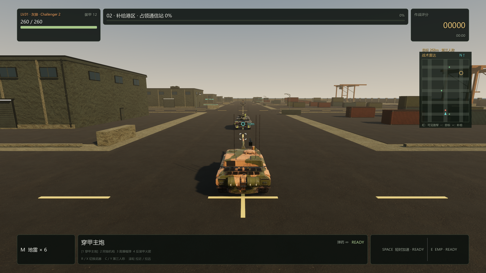
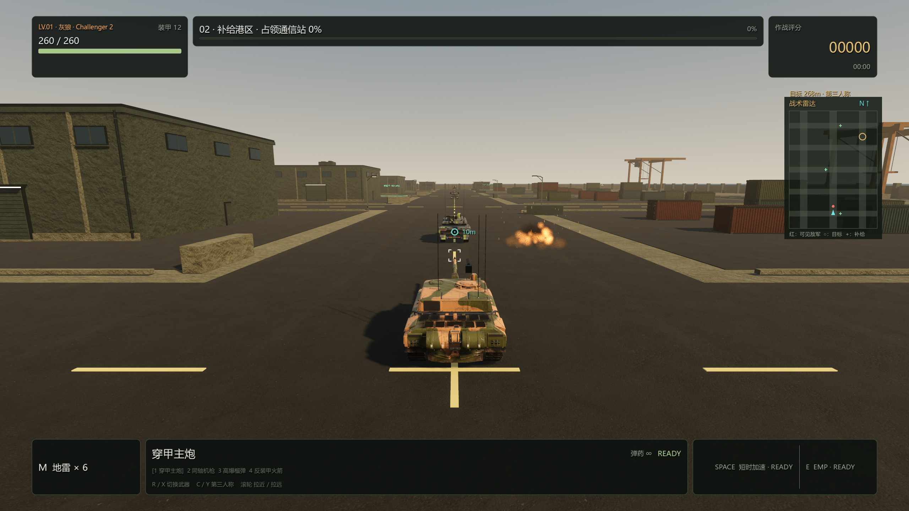

# PC 0.3.0 自检记录

2026-09-09，Windows x86_64，Godot 4.7.2 / Forward+ / Jolt Physics。

## 可玩内容

- 三关连续战役，每图 288 × 384 米，6 / 8 / 10 辆巡逻敌车，每关有前置任务和首领。
- 工业外围清除巡逻队；补给港区占领通信站；指挥堡垒炮击燃料库。
- 可选择 KF51、Challenger 2、KV-2 三种授权底盘；六种敌军战斗角色。
- 穿甲主炮、同轴机枪、榴弹、火箭；真实炮口、有限俯仰、装填与弹量。
- C 切换俯视/第三人称，滚轮变焦，镜头碰撞回缩，第三人称按镜头方向移动。
- 更换了炮弹轨迹、装甲命中、火焰、黑烟、扬尘、碎片及武器录音。

## 自动验证

完整 `scripts/build-pc-godot.ps1` 通过 **454 项断言**，另有 UI 构建烟测和导出成品结构、SHA-256、版本、ZIP、启动烟测。

| 测试 | 通过数 |
| --- | ---: |
| 逻辑与存档 | 51 |
| 真实场景集成 | 42 |
| 负重轮几何与运动 | 33 |
| 爆炸粒子、共享资源与数量上限 | 25 |
| 战斗与地雷回归 | 27 |
| 车辆、武器与瞄准回归 | 29 |
| 战术雷达与界面 | 23 |
| 战斗节奏 | 50 |
| 四武器、弹量、巡逻视线与整备 | 41 |
| 实体弹道与扫掠碰撞 | 19 |
| 炮管俯仰与高处目标实弹命中 | 16 |
| 三图出生、道路、巡逻回环与目标区 | 34 |
| 三关目标、首领、奖励、失败及连续推进 | 51 |
| 第三人称输入与真实 SpringArm 碰撞 | 13 |

测试覆盖 130 米/秒弹体对薄墙的连续碰撞、四武器命中高处目标、HE 在 60 米处的落点、切换 AP/HE 不绕过共享炮膛装填，以及失败/迟到回调/重复结算不重复解锁和奖励。战役与视觉测试使用独立测试存档。

自检修复第三人称仅水平射击的问题，统一实际炮口、炮管俯仰和准星预测；另修复粒子缩放纹理只输出 R 通道造成 Y/Z 为零、火焰烟尘不可见的问题，加入 XYZ 尺度和 GPU 像素验证。最终渲染重新检查了闪光、火焰、烟尘三个阶段。

## 实际游戏模拟与性能

输入驱动的自动试玩使用真实车辆、Jolt、弹体和正常 HP/伤害，不强制击杀或胜利。首关出生点静止 30 秒，首发受伤在 12.87 秒，剩余装甲 180.8/260；90 秒街道机动击毁 6 辆普通车，剩余 197.76/260。单独 Boss 测试只用主炮，58.5 秒失利，Boss 剩余 17.4 HP；这不是人工通关记录。完整输出见 [自动试玩数据](pacing-0.3.0.json)。

第三关 10 辆坦克连续巡逻 120 秒均完成全部路点；远离玩家时无射击。将一辆敌车引离巡逻路后，其能绕过建筑返回原路线。

GTX 1660 SUPER，无截图、关闭帧率限制/VSync，各关预热 60 帧后采样 240 帧，第三人称、AI 持续运行：

| 配置 | 工业外围 | 补给港区 | 指挥堡垒 |
| --- | ---: | ---: | ---: |
| 2560 × 1440，高档，平均 FPS | 86.5 | 94.0 | 90.9 |
| p95 帧耗时（毫秒） | 14.45 | 12.89 | 14.97 |
| 1920 × 1080，中档，平均 FPS | 154.4 | 147.7 | 131.5 |

中档内部渲染比例为 0.85。此为固定巡逻视角的短时基准，不代表所有战斗场景的最低帧率。[完整性能数据](performance-0.3.0.json)。

## 实际渲染

截图为真实游戏场景，使用固定位置的测试车辆与效果展示，不代表人工操作录像。模型与音效署名见 [第三方资产许可](../../pc-godot/assets/THIRD_PARTY_ASSETS.md)。

## 成品

Windows 版本 0.3.0，解压 ZIP 后运行 `IronEmbers.exe`，保持旁边的 `IronEmbers.pck` 和 `credits/`。源码、测试和 PC 构建脚本均已更新；网页版与 Android 未改动。

仍使用三种现有授权底盘，六种敌军角色并非六个新下载模型；履带链条网格仍静态，负重轮会转动。
