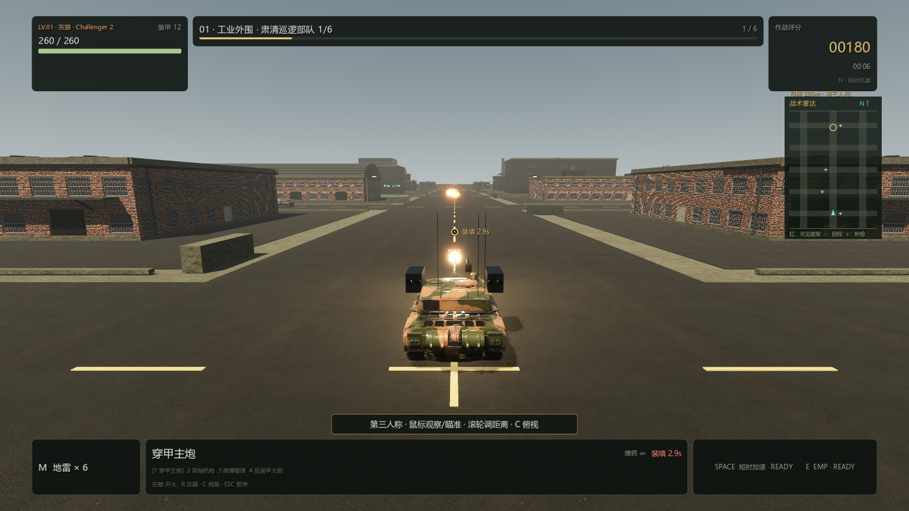
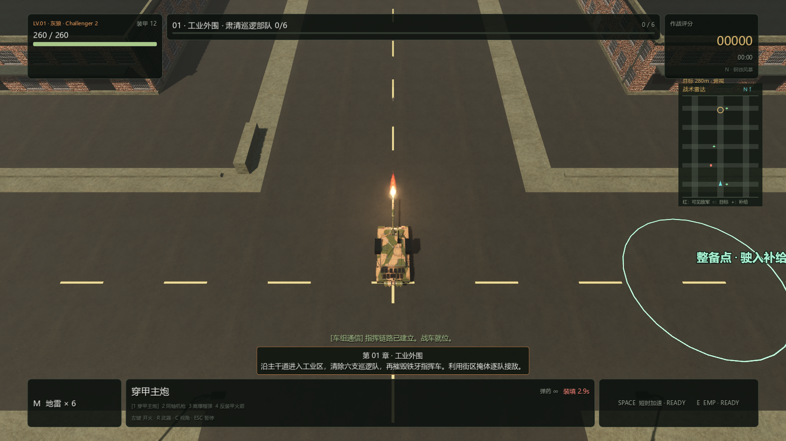

# PC 0.4.1 自检：第三人称输入、炮口效果与手柄

日期：2026-09-10。引擎为官方 Godot 4.7.2，Windows x86_64，Forward+ / Jolt；本轮只更新 PC 版。

## 行为变化

- 第三人称接收原始 `screen_relative` 位移；后端仅提供 `relative` 时也可操作，不再丢弃细微移动。进入第三人称及暂停恢复时立即同步鼠标捕获。俯视、第三人称和菜单之间反复切换仍可正常瞄准。
- 主炮具有更大的定向火舌、短促照明、喷气、推进剂烟和地面扬尘。机枪保留紧凑闪焰，火箭使用较小喷焰；单次主炮最多 40 个粒子，同时最多 8 处炮口效果、5 盏局部闪光灯。
- 主炮 65 毫秒内快速后坐，约 0.56 秒逐渐复位。炮管沿自身俯仰后的轴线回退，车身悬挂外观轻微摆动；物理车体、碰撞和实际发射方向保持正确。第三人称镜头有短促上扬和后移；关闭屏幕震动立即清除镜头后坐，机械动作继续保留。
- 标准手柄采用任意设备编号绑定，支持设备重连、摇杆死区、菜单导航、动态 HUD 操作提示及射击/受击震动调用。使用中的手柄断开立即暂停并释放按住的扳机、按钮与摇杆，重连后由玩家主动继续。

## 自动化与实际渲染验证

完整发布流程通过 **756 项检查**，另有 UI 构造检查、Windows 成品结构/哈希/版本/压缩包校验和实际 EXE 启动检查。

| 检查 | 结果 |
| --- | --- |
| 鼠标事件、视角切换与摄像机碰撞 | 无显示模式 21/21；真实 Windows Vulkan 窗口 23/23 |
| 机械后坐、发射几何、暂停和关闭屏幕震动 | 17/17 |
| 非 0 号手柄输入、战斗、菜单和断线重连 | 42/42 |
| 爆炸与扩大后的炮口效果资源、寿命、数量上限 | 41/41 |
| 其他逻辑、场景、车辆、战斗、弹道、关卡、残骸和音频 | 635/635 |

鼠标测试使用实际 `Input.parse_input_event` → 场景输入分发链，覆盖原始位移、仅相对位移、亚像素移动、暂停后的首个事件及连续三次切换。Windows 窗口额外验证操作系统鼠标捕获模式；显卡为 GTX 1660 SUPER。炮口截图来自生产场景与实际 GPU 渲染，两种视角各验证四种武器。

手柄测试通过 Godot 的 `InputEventJoypadMotion` / `InputEventJoypadButton` 注入设备 7，模拟断开后以设备 9 重连。本机 `Input.get_connected_joypads()` 返回空数组，**没有实体手柄兼容性或震动手感实测**。成品桌面操作的额外复核被 Windows 自动化接口错误 `0x80070005` / `0x80070057` 阻挡；上面的窗口鼠标测试属于引擎事件注入验证，不代表系统鼠标人工试玩。

最初手柄测试退出时出现音频播放资源释放提示；已接入统一音频关闭与真实墙钟等待，并单独重跑 42/42、干净退出。重开战局的清理检查也已更新为检查空间战斗对象，持续存在的输入服务应保留。测试目录从发行包中排除。

## 操作

| 操作 | 键鼠 | 标准手柄 |
| --- | --- | --- |
| 移动 / 瞄准 | WASD / 鼠标 | 左摇杆 / 右摇杆 |
| 开火 / 精瞄 | 左键 / — | RT / 按住 LT |
| 换武器 | 1–4 或 R | X 或十字键右 |
| 俯视与第三人称 | C | Y |
| 镜头距离 | 滚轮 | 十字键上下 |
| 换 BGM | N | 十字键左 |
| 加速 / EMP / 布雷 | 空格 / E / M | LB / RB / R3 |
| 菜单选择 / 确认 / 返回 | 方向键 / Enter / Esc | 摇杆或十字键 / A / B |
| 暂停 | Esc | START |

## Windows 成品

`outputs/pc-godot/Iron-Embers-Windows-x86_64-0.4.1.zip`

SHA-256：`78c22700421961dd6d12b894a79456426fe5e15812073021c834ee1b378c793d`

解压后双击 `IronEmbers.exe`，保留同目录 `IronEmbers.pck` 与 `credits/`。新增镜头和手柄逻辑不修改存档格式。构建入口为 `scripts/build-pc-godot.ps1`，其中已接入后坐力与手柄回归测试。

## 渲染截图

第三人称主炮开火（游戏 GPU 实际渲染）：

俯视主炮喷焰（游戏 GPU 实际渲染）：

Challenger 2 模型作者 tomm8，CC BY 4.0；完整模型、环境与音频许可见 `pc-godot/assets/THIRD_PARTY_ASSETS.md` 及发行包内 `credits/`。
