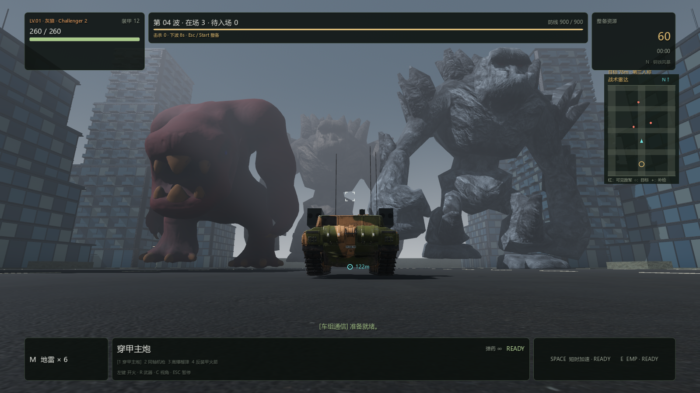
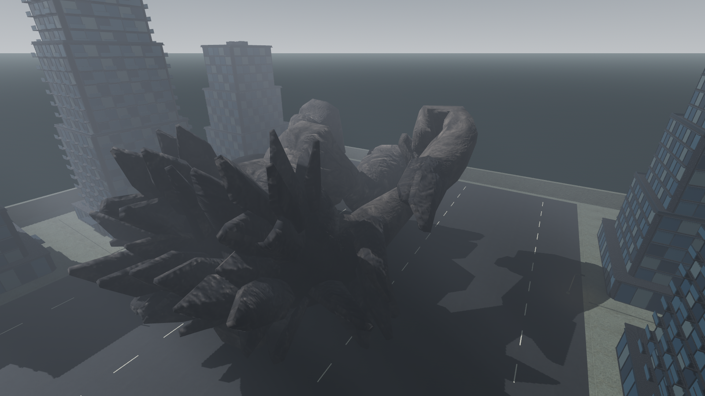

# PC 0.4.10 — 追击巨怪、入场恢复与无损优化

本轮针对 Windows。Android 和网页没有改动；Mac 导出脚本同步版本与许可，
但没有把历史 Mac 0.4.9 ZIP 当成这次的更新产物。

## 玩法与续波

- 新增 34m 深渊吞噬者、52m 裂岩巨像、72m 断岳巨神。现在共九种角色、
  五套原始骨骼模型；52m 和 72m 共享岩石魔像网格，不算两套原始模型。
- 普通波次轮换六类怪物；第 2 波及每 5 波加入灭城巨蜥，每 3 波加入泰坦，
  每 4 波加入 72m 断岳巨神。巨型配额仍有上限。
- 移速约为原来的 1.85 倍（后续波数有缓慢增长，上限 4.8m/s），
  行走和脚步节奏随之调整；没有增加攻击伤害。约 48m 起发现可见坦克，
  大怪感知距离随体型增加；中弹后短时间内会从更远处追击可见的玩家。
  仍保留 1.65 秒重击预备、4.6 秒冷却，蓄力中可以逃出攻击范围。
- 保留清空活体及待入场队列后最多 6 秒续波，以及未清场时的 65 秒增援。
  入场间隔由约 6–7 秒缩短至约 2–4 秒；出生点更近但保留玩家安全距离。
  入口从三路两排扩展至三路五排，全部在实际地图内，保持活体上限 18、尸体上限 8。
- 基线普通清场测试本来就能进入第六波，未复现用户所见的永久停波。
  本次补到了旧六个候选入口均被占用的失败条件，并用真实怪物验证深处入口可继续补兵。
  另加正常 game/HUD 运行下的第一波清场、暂停/恢复和第二波自然到达回归，
  不调用 begin_wave、不手动推进倒计时来证明该流程。

## 性能证据与范围

相同机器、同一 headless Godot 4.7.2 热点探针；每种怪物死亡测 8 次取中位数，
界面快照更新测 300 次均值。改前 `work/pc0410-perf-before.log`，
改后最终 `work/pc0410-perf-final.log`。这是 CPU 路径耗时，不是整局 FPS 或 GPU 基准。

| 路径 | 改前 | 改后 |
| --- | ---: | ---: |
| 巨尸死亡处理 | 2.668 ms | 0.169 ms |
| 岩魔死亡处理 | 3.790 ms | 0.142 ms |
| 巨蜥死亡处理 | 5.436 ms | 0.150 ms |
| 战斗 HUD 快照/更新均值 | 0.723 ms | 0.396 ms |

- 蒙皮权重只按共享 mesh/skin 扫描一次，开战前预热索引。
  死亡时仍从当前姿势获取同一批真实变形骨骼，保持倒地贴地、全部表面淡出和尸体寿命。
- 怪物感知与邻居分离每 0.15 秒交错更新，位移、物理碰撞、动作及攻击仍逐物理帧执行；
  生产环境复用 director 活体名单，避免每只怪物每帧重新查询场景分组。
- 活体/尸体名单原位移除失效成员；只更新当前可见菜单。
  战斗 HUD 不再逐帧生成暂停商店报价，进入暂停时立即刷新完整报价。
- 没有降低分辨率、材质、纹理、网格细节、阴影、天气或特效配置。
  此测试不能证明所有间歇卡顿均已消失，也没有用截图瞬时 FPS 代替帧时间测量。

复测：`res://tests/endless_performance_probe.tscn -- --test`。

## 原始素材与实际画面

新增 [Glutton Demon](https://opengameart.org/node/64952)（Teh_Bucket / RayMooHawk，CC0）和
[Rock Golem](https://opengameart.org/content/rock-golem)（hendori-sama / umask007 / Dm3d，选用 CC BY 3.0）。
保留原作网格、UV、法线贴图、骨骼与采样行走；没有使用吞噬恶魔的卡通替代材质。
下载哈希、署名和修改记录见 [素材许可](../../pc-godot/assets/models/monsters/colossal/CREDITS.md)。

转换额外处理两类老 Blender 问题：明确绑定动作 slot，导出前应用原作 Mirror 修改器。
否则会出现有骨架却没有动作，或者只导出半边身体。下载文件禁用脚本自动执行。

在 GTX 1660 SUPER / Vulkan Forward+ / 高画质 / 1600×900 实际渲染检查四张图，
覆盖完整身体、正面贴图、坦克与大厦参照、72m 巨怪倒下。捕获脚本是
`res://tests/colossal_visual_test.tscn`；没有声称人工长时间试玩或 M4 实机验证。

## 验证与发布

最终有效结果：37 组断言测试共 **1635 项通过**，另有 UI 构建 smoke 检查通过。
包括巨怪动作 44 项、连续波次 17 项、原无尽集成 93 项、新恢复/追击回归 10 项。

验证过程：首次完整运行 `work/build-pc-0.4.10.log` 的前 36 组 1625 项全部通过；
最后一组有一个不稳定夹具——小怪可从较近空隙合法入场，而断言只接受最远入口。
修正为旧两排入口确实放不下的 60m 巨蜥后，`work/pc0410-recovery-final.log`
10 项通过。其后游戏源码没有再变更，以 `-SkipTests` 重新导出，保留成品检查，
没有重复运行已通过且未受影响的 36 组。

`work/build-pc-0.4.10-final.log`：Release 导出成功，EXE 版本 **0.4.10.0**，
manifest 文件哈希、ZIP、第三方 credits 和成品 headless 180 帧启动检查通过。
该成品启动检查不等于人工持续游玩；实际 GPU 画面见前述单独捕获。

- 成品：`outputs/pc-godot/windows-x86_64/IronEmbers.exe`（保留相邻 PCK 和 credits）。
- ZIP：`outputs/pc-godot/Iron-Embers-Windows-x86_64-0.4.10.zip`。
- ZIP 大小：**229,959,325 字节**。
- ZIP SHA-256：`8c062d4a3d80281d57edacc19f2172f3debb6b411d6b09f442fb90bd8f00d996`。
- ZIP 仅是本地产物，提交代码不表示已上传公开下载服务器。
