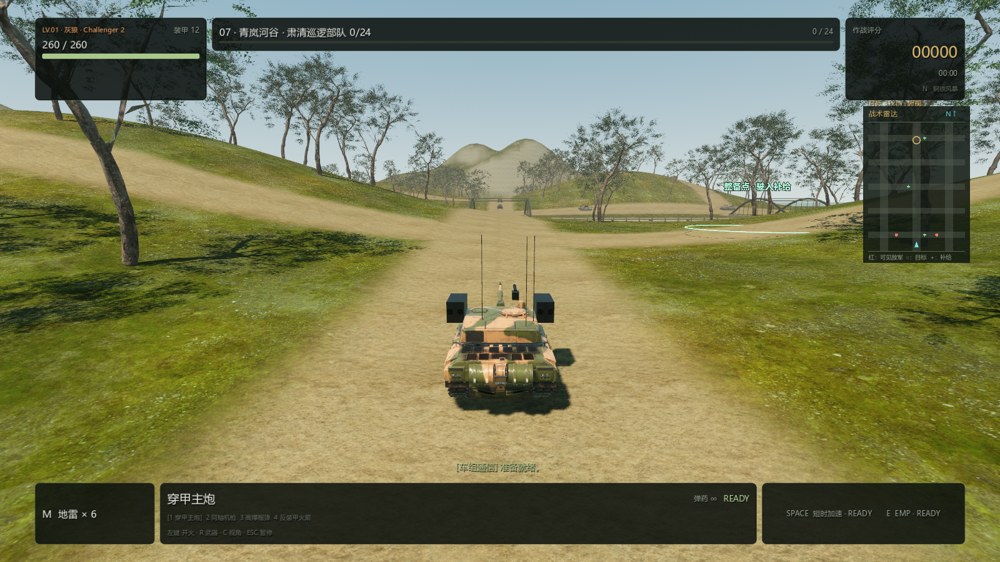
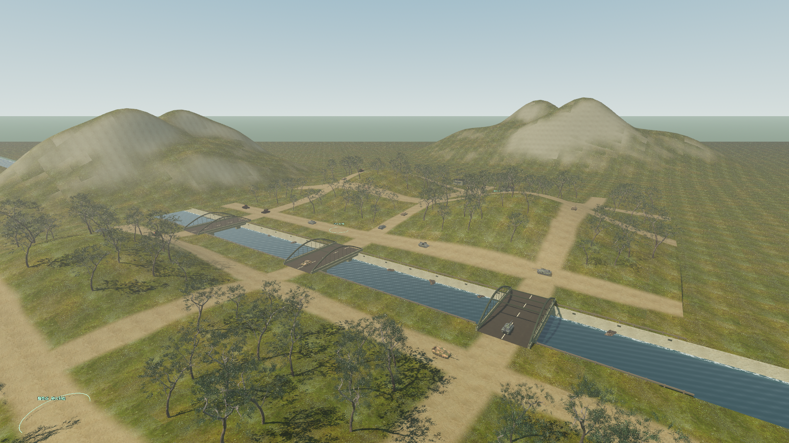

# PC 0.4.13 — 青岚河谷

## 地图与入口

主菜单选择 **新地图 · 青岚河谷** 可立即进入，无需先打通旧章节；它同时作为
第七关接在原战役之后。直接进入不伪造前六关的通关记录，重复完成也不重复奖励。

- 可玩范围 288 × 384 米，连续起伏的草地高度场、四组主要丘陵和沿坡土路。
  地表网格与物理碰撞共用顶点；出生点、巡逻点、补给点与 Boss 按同一高度函数定位。
- 160 棵带原始 UV/PBR 贴图的树木，随机高度约 12–21 米，树干有独立碰撞。
  树林避开道路和桥口，按空间区域使用 MultiMesh 批次；叶片采用独立 LOD 精度，
  避免中远景过早失去树冠。背景山体不使用土路着色。
- 真实下凹河道、动态水面、岩石河岸、木护栏与三座可通行的桥。
  河床与水面不充当隐形路面，敌车沿已有桥梁门户导航过河。
- 24 辆巡逻战车，清场后激活苍松山地指挥车；保留补给、雨雪设置和两种视角。
- 低位避障射线命中可行走坡面时不再视其为墙，按坦克自身坡度阈值继续爬坡。

## 素材

树木来自 Rico Cilliers 的 [Poly Haven Tree Small 02](https://polyhaven.com/a/tree_small_02)，
使用 CC0。已核验原始文件大小与 MD5，并记录 SHA-256；原始工作输入合计
100,974,143 字节。原树约 206 万三角面，运行时资产约 6.5 万面，保留贴图与 UV，
统一落地原点后按实例缩放。导入后实际渲染检查树冠、材质和树干。

来源、许可、转换记录位于
`pc-godot/assets/models/environment/polyhaven_tree_small02/`，Windows 包含对应 credits。
原始大文件留在 work，运行使用转换后的 GLB 及 Godot 导入依赖。

## 验证

最终增量日志位于 `work/pc0413-*.log`：

| 检查 | 通过数 |
| --- | ---: |
| 新地图菜单入口、部署、高度场、天气、爬坡与过河 | 17 |
| 七关任务、Boss、解锁、结算、重玩 | 84 |
| 原六张工业地图道路与出生净空 | 85 |
| 原河流双向实际通行与追击导航 | 19 |
| 原地形碰撞与雨雪材质回归 | 27 |
| 敌车主动追击与搜索 | 13 |
| 手柄操作、断连恢复与新菜单焦点顺序 | 43 |
| 合计 | **288** |

上述均退出 0；另有 `game_ui_smoke_test.gd` 通过。
手柄回归原先假定任务选择下一项就是车型，新增入口后更新到实际菜单顺序并重新通过。

新地图使用真实坦克 AI 与物理运动：沿东侧坡路行驶至目标，最高到达 **18.56 米**；
从南岸斜向出发，找到中央桥、跨河并到达北岸目标，最低车体高度约 **-0.06 米**，
未掉进河床。山脊可实际遮挡视线，雨雪参数也验证传入可玩高度场材质。

`woodland_visual_test.tscn` 使用 Forward+、1600×900、高画质，检查第三人称、
全景、河岸、雨天和雪天五张截图。远程桌面当前无法初始化 WASAPI，最终视觉检查
显式使用 Dummy 音频驱动；本轮没有修改声音资源或实际游戏音频设置。
截图进程报告 1–2 FPS；相同条件下旧工业地图对照也为 1 FPS，且帧率上限为 60、
低功耗模式关闭。因此这些截图只证明渲染结果，不作为前台游戏帧率或性能提升的证据。

## Windows 成品

相关检查完成后执行 `scripts/build-pc-godot.ps1 -SkipTests`；导入、Release 导出、
180 帧成品 headless 启动、版本/清单/哈希/ZIP 检查全部通过。
日志为 `work/build-pc-0.4.13.log`，EXE 版本 **0.4.13.0**。

- `outputs/pc-godot/windows-x86_64/IronEmbers.exe`，需保留相邻 PCK 与 credits。
- `outputs/pc-godot/Iron-Embers-Windows-x86_64-0.4.13.zip`：**247,697,647 字节**。
- SHA-256：`8d9798e4b272bf061f308733b1788acf8712ea27622c4a6b879a6673cc2ba57c`。

本次仅导出 Windows，Mac 构建脚本保持版本一致但没有生成新 Mac 包；Android 与
网页未修改。ZIP 是本地产物，代码推送不表示 ZIP 已公开上传。
