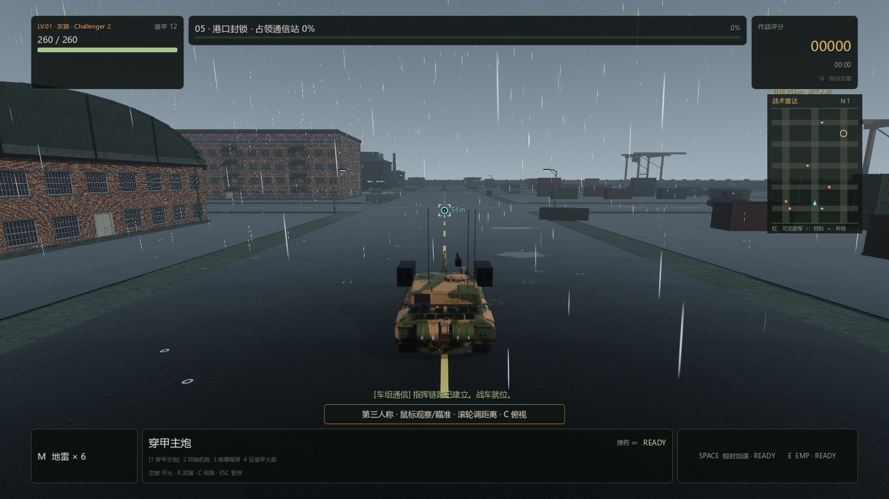
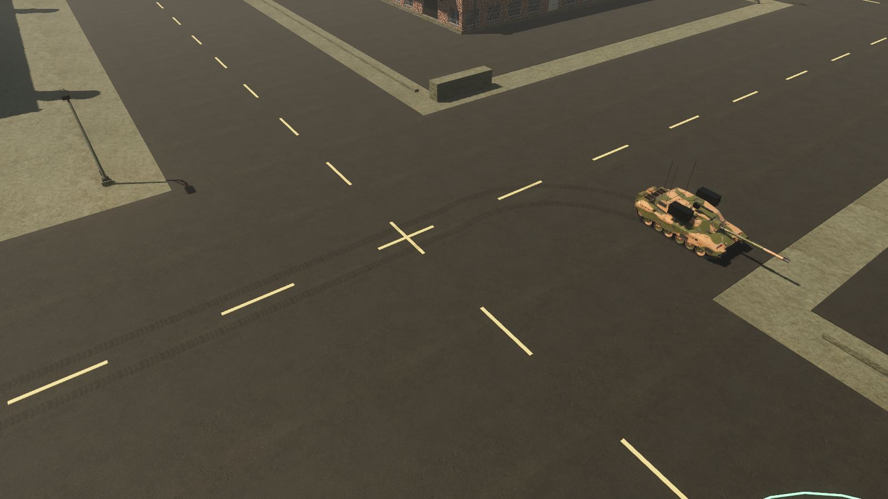
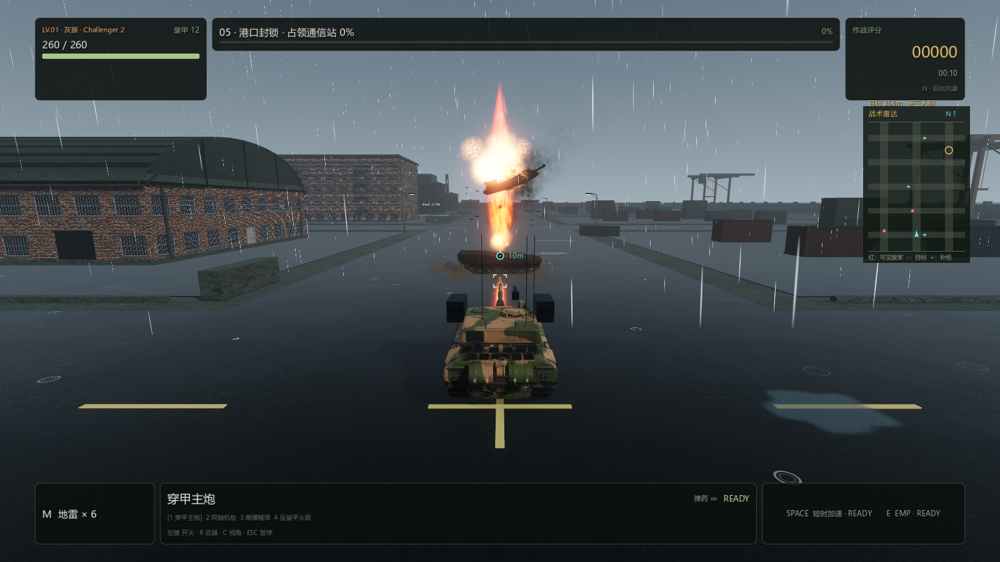

# PC 0.4.2：雨景、车辙与殉爆

日期：2026-09-10。Windows x86_64，官方 Godot 4.7.2，Forward+ / Jolt。

## 四项调整

1. **敌人取消布雷。** 普通敌军、巡逻队和 Boss 不再携带地雷，战斗和巡逻代码不再调用布雷；角色能力入口、游戏创建入口和独立地雷逻辑均拒绝敌方布设。即使强行给予敌车地雷库存也会拒绝。原布雷车改为“铁卫巡护车”，保留主炮参数，替换雷架外观。玩家布雷、敌车触雷及 EMP 排雷继续可用。
2. **更猛烈的概率殉爆。** 保留 25% 概率和 3.3–7.2 秒延迟；约 10 米的火柱迅速向上喷出，配合上冲火团、灼热碎片、黑烟、地面尘浪和更猛烈的炮塔抛飞。9 米伤害范围、建筑遮挡、双方受伤规则和暂停保护保持正确。火柱快速消退，残烟继续扩散。
3. **部分关卡有雨。** 第 2 关小雨，第 5 关较强降雨，其余四关干燥。雨滴、地面涟漪、积水、湿路面、阴天光照和原创雨声共同表现天气。雨滴在玩家周围有限区域循环，屋顶、机库及装卸棚通过高度纹理遮雨；接近镜头时淡出，减少长亮条遮挡瞄准。暂停冻结雨景和雨声，换关释放。
4. **双履带印。** 玩家与敌人行驶后留下贴合路面的鞋块纹理，支持前进、倒车、差速转弯和缓坡；停车不再生成，离地、台阶与传送不连接错误长条。按低/中/高/极高画质限制 128/256/448/640 段，玩家保留约 43% 独立配额。雨天印痕更深、消退更快，旧印迹渐隐，换关清理。

## 检查结果

21 组回归的最终验证共 **862 项通过**，另外通过 UI 构造和成品结构、哈希、版本、压缩包及实际 Windows EXE 启动检查。总数包含全量发布检查后的 2 项殉爆优先级补测；该小修复跑残骸 30/30 和爆炸 41/41 后重新导出。

- 地雷权限：逻辑、实际场景、所有已部署敌人及 Boss 的布雷入口、雷达、EMP 和补给回归通过。
- 天气：36 项通过，覆盖关卡选择、雨量预算、屋顶/棚顶遮挡、路面积水、跟随范围、暂停、声音循环与晴雨关卡切换。
- 车辙：55 项通过，包含真实 `Input` 驾驶与 Jolt 行驶产生玩家印迹、真实敌人 AI 巡逻产生印迹、停车停止采样、暂停、倒车、转弯、坡面、跳跃、传送、容量、旧印回收及重开/换关。
- 殉爆：30 项通过，覆盖概率参数、延迟、火柱、真实炮塔运动、伤害只结算一次、9 米边界、建筑遮挡、暂停、终态保护与并发预算。总爆炸池占满时，殉爆优先替换最旧普通爆炸残烟，已有殉爆保留；普通炮口/爆炸 41 项回归仍通过。
- GPU 实际渲染：6 张晴雨双视角图、3 张车辙图、20 张晴天与雨天殉爆图，共 29 张。确认车辙无黑方块和浮空；雨滴、涟漪、火柱、炮塔与黑烟能正常分层显示，日志没有 Shader 或运行错误。截图取景/定时由自动化夹具控制，不用于推断帧率。

性能边界：主炮/爆炸粒子继续共享原有预算，额外殉爆每次最多 144 粒子、同时最多 3 组，并计入总共最多 8 个大爆炸和 5 盏瞬时灯；重雨最多 3200 雨滴、260 涟漪和 84 片积水，使用 3 个批量绘制节点。

## 短时性能检查

显卡 GTX 1660 SUPER。窗口 1920×1080、中画质、内部渲染比例 85%（约 1632×918），关闭 VSync 和帧率上限。固定第三人称机位，玩家不受伤、敌人正常模拟；向实际道路预填充印迹历史，保留 246/256 段印迹。每组预热 90 帧，采样 240 帧，采样期间不截图或写文件。

| 场景 | 活动车辆 | 平均 FPS | 95% 帧耗时 | 平均物理耗时 |
| --- | ---: | ---: | ---: | ---: |
| 第 1 关，干燥、车辙 | 8 | 140.9 | 10.51 ms | 4.06 ms |
| 第 5 关，重雨、车辙 | 20 | 90.6 | 17.42 ms | 7.29 ms |

两行是不同关卡和车辆负载，不能相减当作降雨开销。该短时检查没有同时触发多处殉爆，不代表完整战役的最低帧率。复现脚本为 `pc-godot/tests/weather_tracks_benchmark.gd`，原始报告见同目录 `performance-0.4.2.json`。

## 成品与复现

构建：`pwsh -NoProfile -File scripts/build-pc-godot.ps1 -Configuration Release`

成品：`outputs/pc-godot/Iron-Embers-Windows-x86_64-0.4.2.zip`。解压后双击 `IronEmbers.exe`，保留 `IronEmbers.pck` 与 `credits/`。本轮不修改存档格式。

## 实际游戏渲染

第 5 关的重雨与湿路面：

沿道路投影的双履带印和转弯：

雨中殉爆，火柱上冲并掀起炮塔：

模型、环境与音频的完整来源和许可见 `pc-godot/assets/THIRD_PARTY_ASSETS.md` 及发行包的 `credits/`。本轮新增雨声、雨景 Shader 和履带印纹理由项目代码生成。

发行 ZIP SHA-256：f98af04cfacc277186efefd9eec16874cedd34b054e474bdd8b832bc75601607
