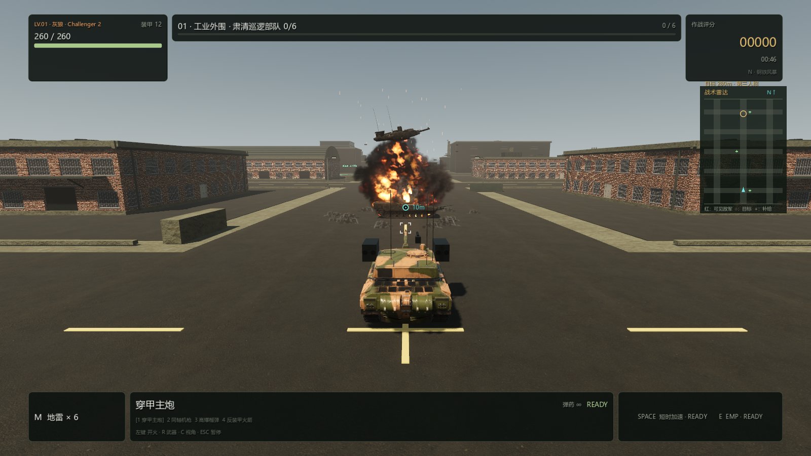
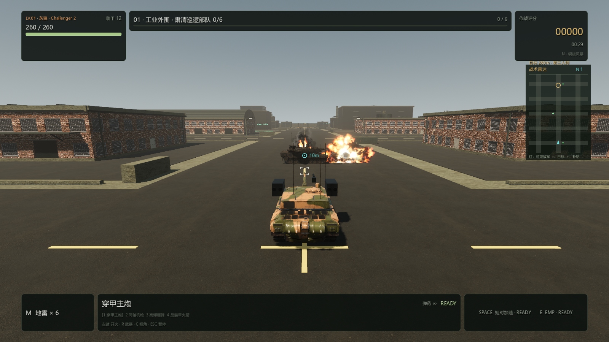
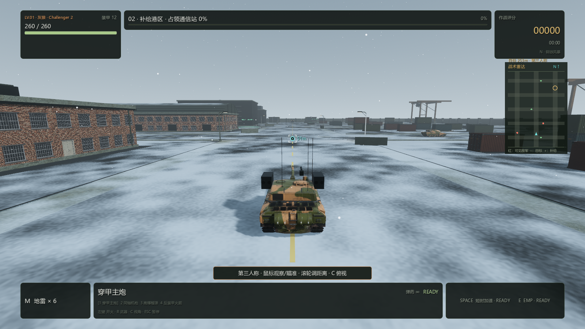
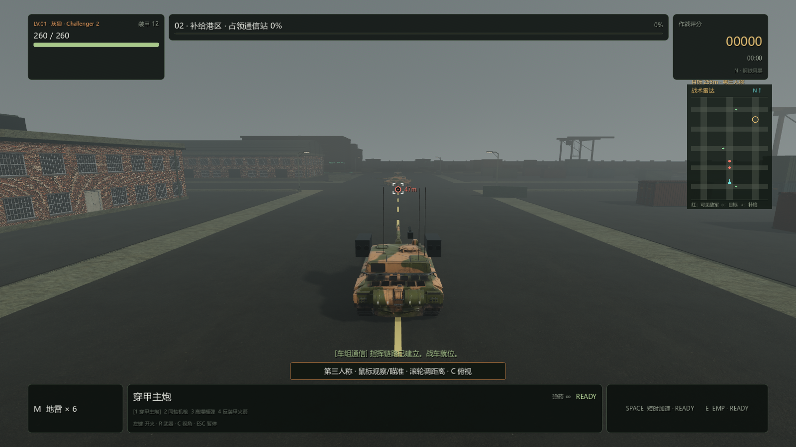
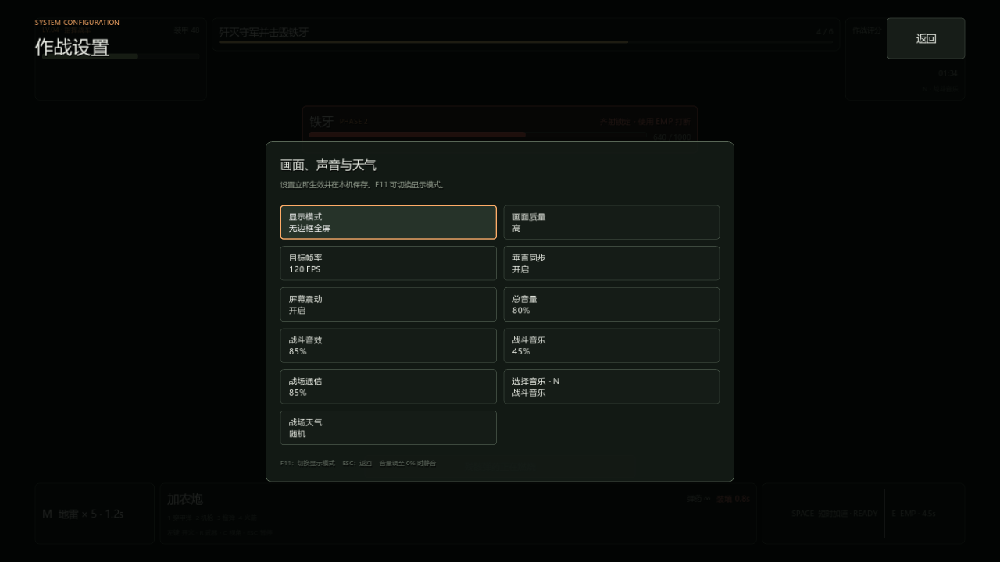

# PC 0.4.3：真人配音、流体烟火与天气选择

2026-09-10，Windows x86_64，Godot 4.7.2 / Forward+ / Jolt。

## 真人战术通信

13 段英文真人录音来自 [Kenney Voiceover Pack](https://kenney.nl/assets/voiceover-pack)，采用 CC0 1.0 许可。原始压缩包列明男演员 Jeffrey M. Smith、女演员 Giselle；[作者的原始发布页](https://opengameart.org/content/voiceover-pack-40-lines)也说明是演员录制。保留原音高、完整句子和表演，只做轻量滤波、音量整理和端点淡入淡出。PC 旧中文 TTS 音频与生成器已移除。

中文字幕对应实际英文，例如 Target destroyed 对应“目标已摧毁”。弹药不足、弹药耗尽、装甲补给和排雷完成四项没有对应的录音，用准确状态字幕与轻提示音。短语字幕至少显示 1.8 秒，文字通知显示 2.8 秒。队列上限、优先级、重复冷却、暂停和人声期间的音乐压低继续生效。

原始许可、演员说明、源文件和成品哈希、逐条英文与中文字幕收录于 `pc-godot/assets/audio/battlefield/`，发行包同时包含许可文件。

## 爆炸与残骸

采用 [Unity Labs 公开的 CC0 Houdini 动画序列](https://unity.com/blog/engine-platform/free-vfx-image-sequences-flipbooks)，包含爆炸、翻卷烟雾和火舌三张动画图集。Godot 对相邻帧插值并软化与地面、车体的交界。火团快速膨胀并冷却，烟尘降低速度后向上翻卷，贴地尘浪速度逐渐归零，火星和碎片按抛物线回落。

殉爆采用多股短促上冲火团和炮塔抛飞，随后转成烟雾。残骸的小火舌也使用流体动画。25% 殉爆概率、3.3–7.2 秒延迟、9 米伤害范围、建筑遮挡及双方受伤规则保留。大爆炸最多同时 8 组，殉爆最多 3 组，瞬时灯最多 5 盏；总池占满时，殉爆优先替换最旧普通爆炸残烟。

这些是预先模拟的图像序列，运行时不计算流体，构建和离线游玩也无需联网。素材来源、许可、转换和哈希见 `pc-godot/assets/fx/fluid/`。

实测发现图集首帧火团只占单格约 32% 宽，旧的随机小缩放和低位落点会把火团藏在地面或车体后。最终版收窄主体随机缩放、抬高可视中心，并以连续主体连接减速的上冲火团。新回归按真实图集热区计算初生可见直径与高度，防止再次出现“有资源但看不到爆炸”。

## 天气选择

作战设置新增天气按钮：**随机 → 晴天 → 小雨 → 大雨 → 雪天 → 雾天**。新安装与旧版本配置默认随机，每次出击重新选择；固定天气跨关卡保留。设置页显示随机抽到的当前天气，切坦克、开关菜单或调音量不会重新抽取。

战斗中切换立即改变材质和环境，保留角色、位置、血量、得分、任务进度及原有车辙池。暂停和设置页冻结雨雪运动，恢复战斗后继续。返回晴天完整恢复原始天空、日光、雾和 PBR 材质。

雪花低速缓降、随风横移和旋转，地面与屋顶覆盖局部薄雪，屋顶高度纹理遮挡雨雪。雪花使用一个批量节点，通常最多 2300 片、低画质 1495 片；雪天和雾天没有雨声或水花。雨景保留 3200 雨滴、260 水花、84 片积水的上限。修复了实测中薄雪噪声格块和覆盖层深度竞争。

## 验证与运行

22 组最终回归共 **974 项通过**，包括天气资源与生命周期 62 项、天气设置及持久化 52 项、音频行为 97 项、爆炸 45 项、残骸与殉爆 30 项。全量发布回归先通过 973 项；最终火团调参和新增可见热区回归后，重跑爆炸 45/45、残骸 30/30 并重新导出。音频文件解码、哈希、字幕映射和电平检查另有 **123 项通过**。成功的发布及定向回归日志没有脚本错误或警告，成品结构、资源哈希、版本、ZIP 内容及实际 Windows EXE 启动检查通过。

天气检查在实际地图反复切换，核对人物身份、位置、血量、得分、目标进度、车辙池和完整晴天材质恢复。五种天气各检查俯视、第三人称两种镜头；最终爆炸在两种镜头检查 HE、击毁、殉爆各六个时间点，共 36 张渲染图，无 shader 错误。1280×720 原生渲染检查设置页和其他五种 UI 状态，天气按钮完整显示，奇数末行的手柄焦点可达。截图由游戏内自动化夹具取景，不是手工驾驶或实体手柄测试。

## 短时性能

GTX 1660 SUPER，1920×1080，中画质，内部渲染 85%，不限帧、关闭 VSync。玩家固定机位且不受伤，敌军正常巡逻；向真实道路预填充并保留 246/256 段印迹。每组预热 90 帧、采样 240 帧，采样期间不截图或写文件。

| 场景 | 活动车辆 | 平均 FPS | 95% 帧耗时 |
| --- | ---: | ---: | ---: |
| 第 1 关，晴天 | 8 | 135.7 | 11.64 ms |
| 第 5 关，大雨 | 20 | 79.8 | 19.05 ms |
| 第 5 关，雪天 | 20 | 80.6 | 19.39 ms |
| 第 5 关，雾天 | 20 | 79.1 | 19.59 ms |

原始报告见 [performance-0.4.3.json](performance-0.4.3.json)。不同关卡和动态 AI 负载不能直接相减当作天气开销；这是短时检查，不代表完整战役最低帧率，也不包含多处同时殉爆的压力峰值。

## 成品

构建：`pwsh -NoProfile -File scripts/build-pc-godot.ps1 -Configuration Release`。

成品：`outputs/pc-godot/Iron-Embers-Windows-x86_64-0.4.3.zip`。解压后双击 `IronEmbers.exe`，保留同目录的 `IronEmbers.pck` 与 `credits/`。

发行 ZIP SHA-256：3b227be1fa643e1c0f23ec2a223f5efd7982d78e1573a45c3f0a84aed2cc418d
