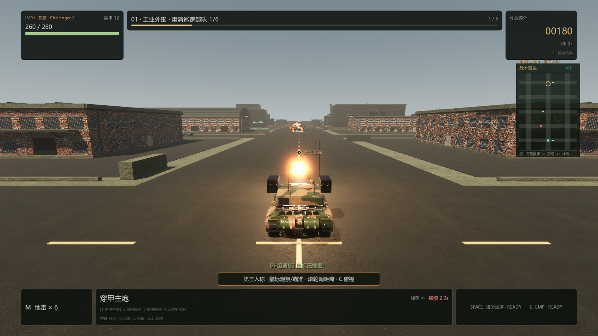
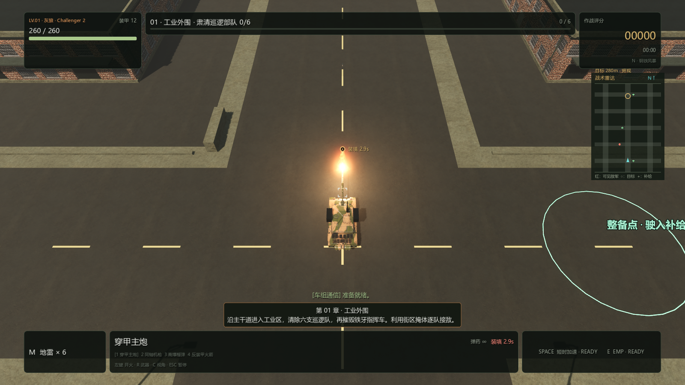

# PC 0.4.4：炮声、炮口火焰与机械后坐

2026-09-10，Windows x86_64，Godot 4.7.2 / Forward+ / Jolt。

## 修复开炮声音太轻或丢失

旧空间音源使用默认 1 米衰减尺度，俯视镜头离车辆约 32 米，会把自己的炮声压低约 30 dB。普通效果共用 24 个声音名额，激烈战斗也可能拒绝新的炮声。

本车主炮、机枪和火箭改用 PlayerWeapons 独立声道，每种武器分别保留有限名额，镜头高度不再改变本车发射声。敌军和车辆运行声经过 WorldSFX，按 28 米尺度校准距离衰减。炮弹发射播放一次完整实录，保留清晰瞬态和户外尾音；开炮时环境效果短暂压低 5 dB，再平滑恢复。Master 峰值限制在 −1 dBFS，所有武器仍遵守音效、总音量和静音设置。

新增测试从实际 Godot 音频混音器采集波形，检查最终 Master 输出。相同主炮录音在 5、32、220 米镜头高度的玩家声道峰值均为 0.595，独立采样起音约 10.7 ms，尾音 RMS 约 0.091。机枪峰值 0.220、火箭 0.332。24 个普通音效及 UI 声音占满时，本车炮声仍播放，最终峰值不超过 0.891；音效静音时 Master 的武器输出为零。报告见 [weapon-audio-0.4.4.json](weapon-audio-0.4.4.json)。这些是引擎实际混音采样，不包含 Windows 扬声器硬件的人工听测。

开局录音由 Go, go, go 替换为男演员完整的 **Ready.**，中文字幕“准备就绪。”，时长约 0.79 秒。录音仍来自上一版已采用的 Kenney CC0 Voiceover Pack，保留原始表演、音高、许可与演员署名，逐文件来源及校验更新到素材清单。

## 炮口火焰与后坐

旧的交叉定向面片从第三人称正后方看接近细线，亮度又在前几帧迅速衰减。现在保留沿炮管喷出的定向气体，并增加迎向镜头的不规则高温核心；加强短时照明，让炮塔、炮管和路面同时受到火光影响。主炮喷焰约持续 0.25 秒，随后只留下轻烟。玩家发射在特效池满时替换最旧的敌方残烟，仍遵守 8 组炮口效果和 5 盏瞬时灯的上限。

真实 `try_fire()` 直接使用物理炮口位置生成火焰和声音，Boss 齐射也使用实际发射口。已经接受的射击先播放反馈，再处理炮管射线可能立即产生的伤害，避免贴近目标的终结一击被胜负切换吞掉炮声；胜负后不能继续发起新射击。炮管 85 ms 内快速回退，保持约 60 ms，再用约 0.70 秒逐渐复位；均衡车型峰值实际退程约 0.65 米。车体视觉悬挂摇动、第三人称镜头抬升和后移更明显，物理车体和已发射炮弹不受视觉动作影响。暂停冻结，关闭屏幕震动后仍保留机械后坐。

GPU 夹具在两个视角调用 10 次实际发射，覆盖主炮、榴弹、机枪、火箭和特效预算饱和，共检查 36 张渲染图。炮口与特效的世界位置误差均为 0.000000 米；主炮与榴弹在 150 ms 仍有清晰热焰，350 ms 时火焰核心和定向气体消失。8 个旧效果占满时，本车火焰依然可见。渲染检查 0 失败，错误日志为空；截图来自游戏内自动化场景。

## 发布验收

最终回归共 **23 组、1022 项通过**，另通过 UI 构造检查。完整 Release 构建先运行 1010 项；收尾复核发现贴近目标的终结射击可能丢声，以及 Boss 墙边齐射的火焰位置遗漏，修复后车辆回归扩展并通过 41/41，后坐重新通过 22/22，再重新导出成品。其中武器混音 23 项、现有音频行为 97 项、炮口和爆炸 53 项；其余覆盖战役、敌军、弹道、相机、手柄输入、天气、车辙和存档。后坐测试调用真实玩家发射，验证独立声道、实际导入模型的退程、镜头响应、精确复位和暂停处理；新增车辆测试使用实际碰撞、受伤和胜负状态切换，检查最后一炮只响一次且终态仍拒绝新射击声音。音频素材另通过 123 项解码、哈希、映射与电平检查。

最终发布日志没有脚本错误或引擎警告。Windows 成品的结构、版本、资源哈希、ZIP 内容和实际导出 EXE 启动检查通过。本轮没有重测长期帧率或实体手柄。

构建命令：`pwsh -NoProfile -File scripts/build-pc-godot.ps1 -Configuration Release`。

成品：`outputs/pc-godot/Iron-Embers-Windows-x86_64-0.4.4.zip`，172,413,454 bytes。解压后双击 `IronEmbers.exe`，保留同目录 `IronEmbers.pck` 和 `credits/`。

发行 ZIP SHA-256：`8d3985f67b3e3a340d87382a2c55fdda5332160f69d54cf27f1c18adced0d1c7`。
