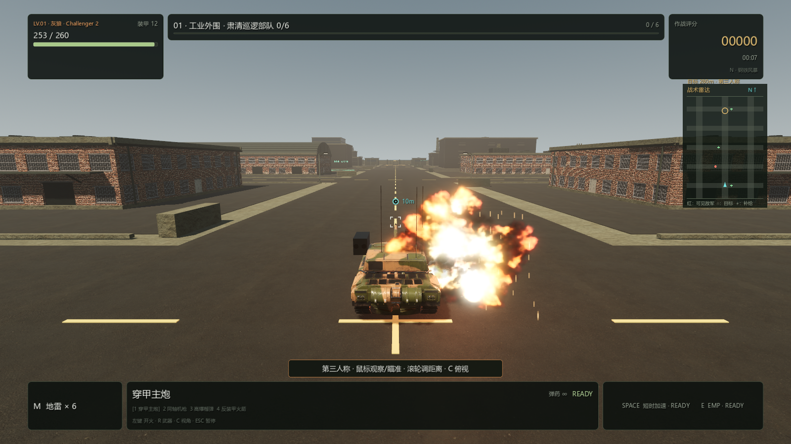
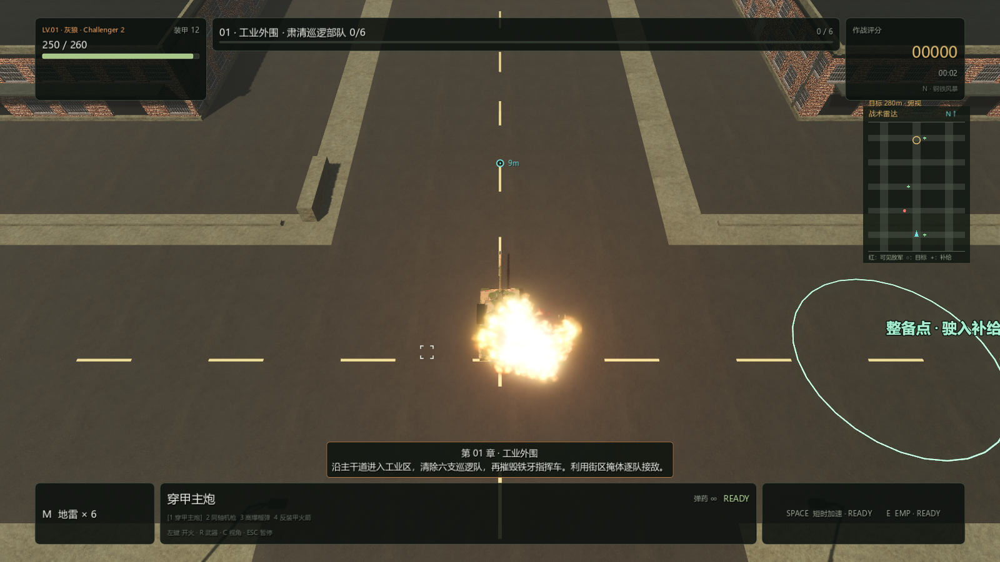

# PC 0.4.5：装甲受击、冲击声和方向震动

2026-09-10，Windows x86_64，Godot 4.7.2 / Forward+ / Jolt。

## 命中表现

普通穿甲弹命中原来只有 0.38 米闪片和细火星，没有专用受击镜头冲击。现在装甲命中具有短促白热闪光、约 0.82 秒的单个流体火团、28 枚金属火星、7 枚有限 GPU 碎屑和快速扩散烟尘，瞬时光照照亮车体与地面。榴弹和火箭进一步扩大主体火团、压力尘浪、火星和碎屑；机枪保持轻型短火星，不生成重炮火球或瞬时灯。

本车命中拥有特效优先级，18 组影响和 5 盏瞬时灯满额时替换旧效果。弹丸扫掠与炮管遮挡路径均传递实际武器种类和受击对象；原有炮口火焰与殉爆表现保留。

## 声音与震动

本车受击使用独立的 PlayerImpacts → SFX 声道。主炮、榴弹、火箭和范围爆炸分别混合已有授权实录的钢铁冲击与低频爆炸，机枪播放短金属敲击。轻金属、重金属和爆压分别最多保留 2、3、2 层；旧尾音平滑衰减。短暂降低环境声，让受击、自己的开炮和通信都有各自清晰的位置。

混音采样中，强烈 HE 受击峰值约 0.668（−3.5 dBFS），起音约 1.83 ms，尾音 RMS 约 0.130；5、32、220 米镜头距离的响度一致。24 个世界声音、自己的炮声、真人通信和受击同时播放时，最终峰值不超过 0.891。音效音量四分之一时实际输出同比降低，音效静音时下游 Master 采样为零；总音量静音的最终路由也通过检查。报告见 [impact-audio-0.4.5.json](impact-audio-0.4.5.json)。验证使用引擎混音采样，没有替代 Windows 扬声器硬件人工听测。

受击新增方向冲击：镜头短暂抬动、向受力方向侧倾、后移并衰减振荡；重击在约半秒内恢复，机枪为更短更轻的点震。手柄重击反馈约 0.38 秒。相机动作不修改玩家存储的瞄准方向、真实车体碰撞或炮管姿态。

同一发弹丸的直击和同帧溅射保留原伤害计算，仅在 90 ms 短窗口内合并音画反馈；同期明显更重的命中可以覆盖轻击。致命受击在切换失败状态前启动声音，暂停冻结相机冲击和声音包络。关闭屏幕震动会立即清除残留镜头运动，声音与外部命中火光仍可用。

## 验证

新增真实受击集成测试 30/30：四种弹丸通过实际扫掠命中导入的玩家坦克，核对伤害、弹种、一次反馈、特效优先级、两种镜头的方向冲击、暂停、关闭震动、准确复位、无敌与友军忽略、致命音效和菜单清理。新增受击混音 32/32，原武器混音 23/23，原音频行为 97/97；爆炸与炮口资源回归扩展为 63/63。

完整 Release 构建运行 **25 组、1094 项回归，全部通过**，另通过 UI 构造检查。最终构建日志没有脚本错误或引擎警告；Windows 成品结构、版本、资源哈希、ZIP 内容及实际导出 EXE 启动检查全部通过。

实际 GPU 检视通过 10 次弹丸扫掠命中玩家，覆盖四种弹药、俯视与第三人称、18 个影响和 5 盏灯满额的情况，共 44 张不同阶段渲染图，0 失败、错误日志为空。画面夹具关闭镜头震动以固定取景；方向冲击由上述真实场景集成测试另行检查。本轮未做新的长期性能或实体手柄验收。

## 成品

构建命令：`pwsh -NoProfile -File scripts/build-pc-godot.ps1 -Configuration Release`。

成品：`outputs/pc-godot/Iron-Embers-Windows-x86_64-0.4.5.zip`。解压后双击 `IronEmbers.exe`，保留同目录 `IronEmbers.pck` 和 `credits/`。

发行包大小：172,419,534 bytes。

发行 ZIP SHA-256：`33b71ec3759d37f4a6f46b3d47a4cd997914ee48ee7debf4ccb0597e46f45952`。
