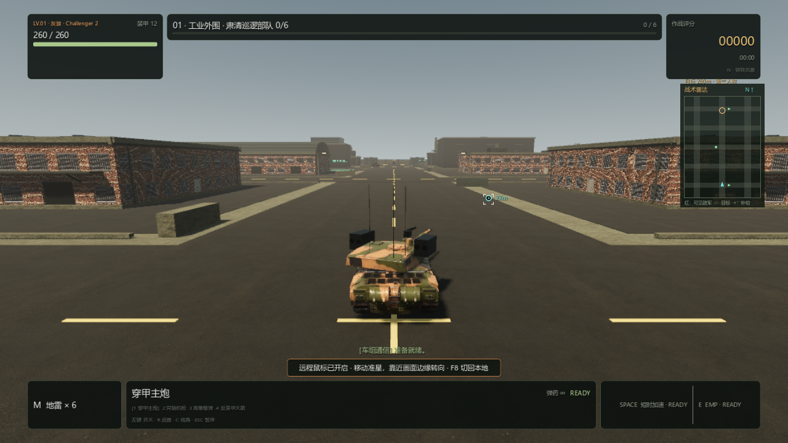
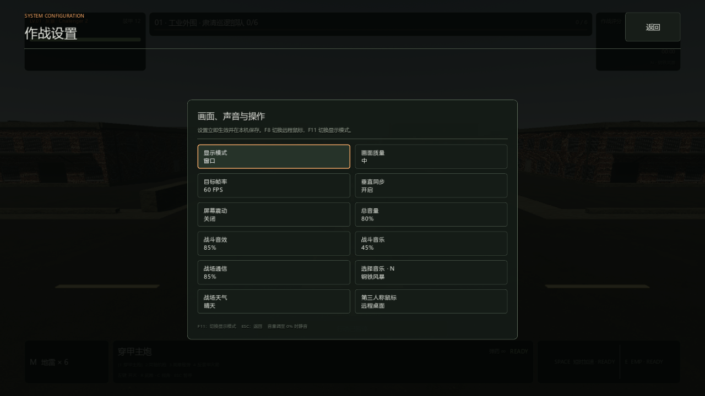

# PC 0.4.6：远程桌面鼠标瞄准

2026-09-10，Windows x86_64，Godot 4.7.2 / Forward+ / Jolt。

## 原因与操作

本地第三人称原本固定中心目标准星，鼠标转动视角来瞄准；圆形弹道标记另外显示炮管当前实际落点。游戏在该视角捕获鼠标，只读取 `screen_relative` 或 `relative`。两者均为零时不会转动视角，而第三人称瞄准射线仍从屏幕中心发出。俯视直接使用鼠标位置，因此提供绝对坐标的远程链路在俯视下可以正常操作。

[Godot 鼠标模式文档](https://docs.godotengine.org/en/stable/classes/class_input.html)说明捕获模式锁定窗口中心并通过相对移动读取输入；[Microsoft RDP 相对鼠标事件说明](https://learn.microsoft.com/en-us/openspecs/windows_protocols/ms-rdpbcgr/9af47964-8bfc-4f43-8a15-4339a89833fa)说明相对输入有单独事件及能力协商。不能据此断言所有远程桌面客户端都不支持相对输入，本次提供的是不依赖该能力的兼容方式。

按 **F8**，或在设置中选择 **第三人称鼠标 → 远程桌面**：

- 移动鼠标直接改变目标准星与实际世界瞄准点。
- 鼠标位于画面中央时只瞄准，不自动转镜头。
- 鼠标停在画面四周约 12% 的边缘区域时持续转向；向外越靠近边缘，转向越快。鼠标移回中央或离开窗口区域后停止边缘转向。
- 再按 F8 切回本地中心准星模式；选择保存在本机，老版本配置默认本地。

兼容模式采用与俯视相同的未捕获指针方式，不调用 `warp_mouse()`。真实绝对事件不能被“相对位移为零”提前拒绝。瞄准沿用实际世界射线、炮管限位和弹道预测。

暂停、视角切换和鼠标模式切换清除旧指针的转向激活状态，恢复后等待新鼠标输入。窗口 `mouse_exited` 信号也立即停止边缘转向，覆盖系统没有再发送越界移动事件的情况；重新入窗后的新移动恢复瞄准。右摇杆接管时停止边缘转向、恢复中心瞄准；再次移动绝对鼠标可以接管，设备提示也同步切换。设置开关只保存鼠标偏好，不重置显示窗口或图形质量。

## 验证与成品

完整 Release 构建运行 **26 组、1120 项回归，全部通过**，另通过 UI 构造检查。边界补修后的远程鼠标定向回归 **28/28**，包括新增的窗口离开信号和重新入窗两项；最终代码重新导出成品并校验。

测试经真实引擎输入分发注入 `relative = screen_relative = (0, 0)` 的事件，检查世界瞄准射线、HUD、中央精确瞄准、边缘持续转向、越界、暂停/焦点、手柄接管、F8、设置按钮、保存及旧配置迁移。原本地鼠标与俯视输入回归通过。窗口离开测试只发 `Window.mouse_exited` 信号，不补造越界移动，确认游戏仍在运行且镜头停止。

实际 GPU 测试 **27/27**（25 项操作检查和 2 张渲染图），确认准星偏离屏幕中心、炮塔随目标转动以及设置完整可见。旧俯视轮询依赖操作系统鼠标位置，其注入检查限定在 headless 中运行；没有用鼠标居中操作移动用户的真实光标。GPU 日志出现本机音频设备不可用并回退至 Dummy 的警告，不影响本轮输入/渲染检查；本轮未重新验收扬声器硬件。

这验证了游戏对绝对鼠标事件的兼容，**尚未直接操控用户正在使用的远程桌面客户端进行端到端验收**。

构建：`pwsh -NoProfile -File scripts/build-pc-godot.ps1 -Configuration Release`。

成品：`outputs/pc-godot/Iron-Embers-Windows-x86_64-0.4.6.zip`。解压后双击 `IronEmbers.exe`，保留同目录 `IronEmbers.pck` 和 `credits/`。

Windows 成品结构、0.4.6.0 版本元数据、资源哈希、ZIP 内容及导出 EXE 启动检查全部通过。完整构建与最终导出日志无脚本错误或引擎警告。

发行包大小：172,423,203 bytes。

发行 ZIP SHA-256：`9417e3a4f98acf45d1f99e922298f336b91bd204dc42de2b2dc220a4fdc5f02d`。
