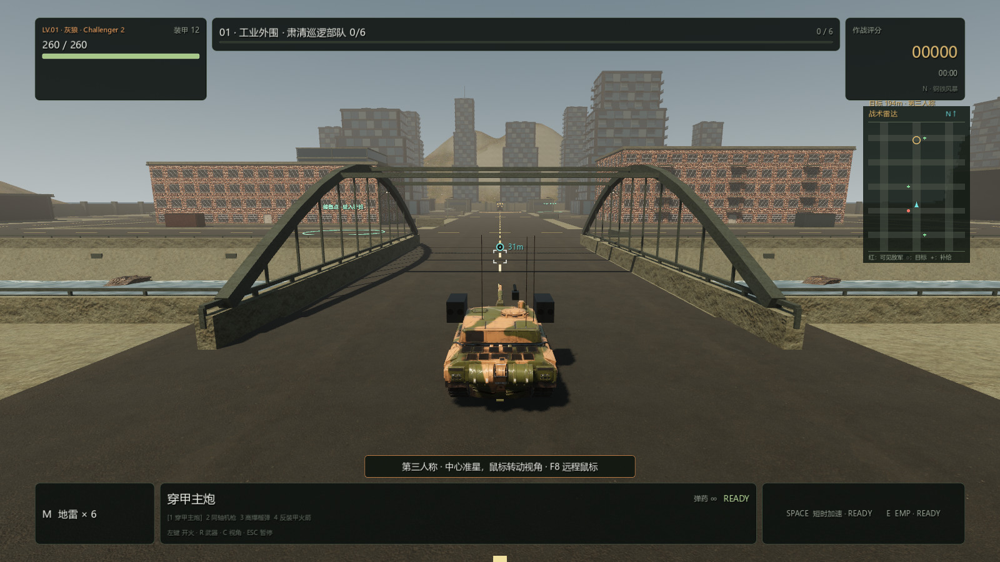
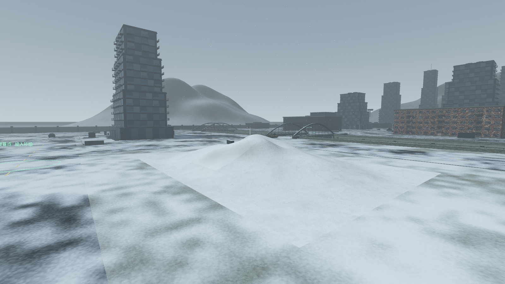
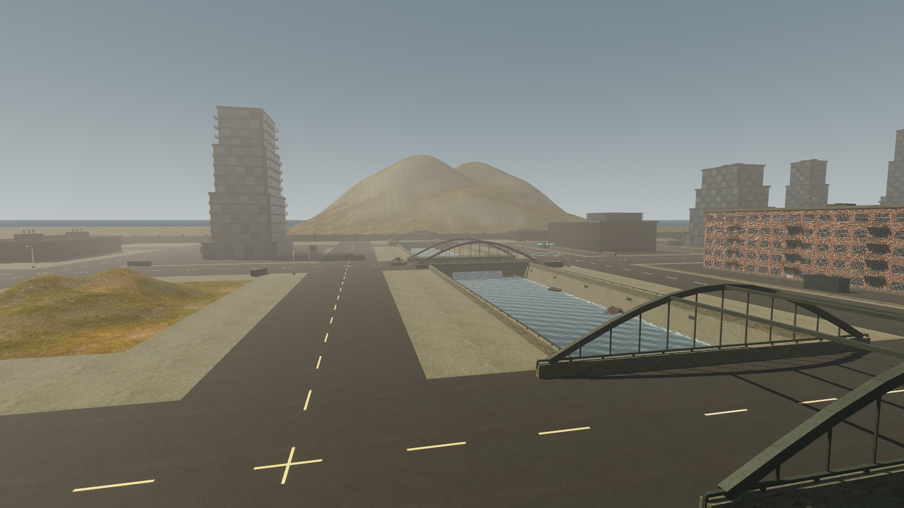
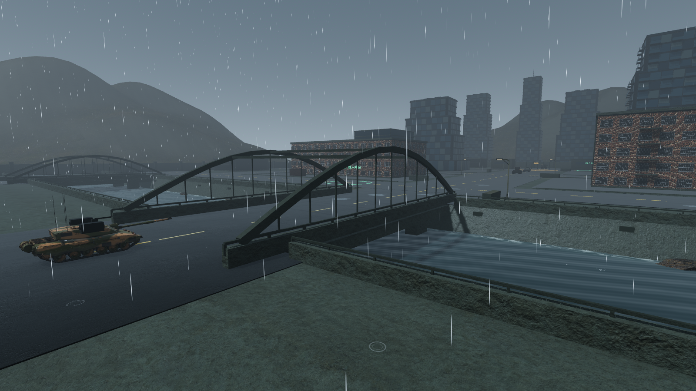

# PC 0.4.7：城市、河流、桥梁与起伏地形

2026-09-11，Windows x86_64，Godot 4.7.2 / Forward+ / Jolt。

## 实际地图变化

六关的 288 × 384 米战区保留三条南北大道、五条横街、任务与补给位置。原来 z=36 的工业地块改为 28 米宽河道，真实地面在 z=22..50 切开，河水位于路面下约 3.2 米。三座桥分别连接 x=-96、0、96 的道路，侧桥净宽 16 米、主桥净宽 18 米。桥面与原地面齐平，具有独立实体碰撞；桥墩、下部梁、钢拱、吊杆、横撑、护栏、岸堤和排水口共同构成桥梁。

河水使用细波位移、交错法线、流向、岸线泡沫和视角相关反光；雨天增加细碎波动。水流时钟随游戏暂停。河岸与桥侧具有实体护栏，河水没有伪装成地面的碰撞。

部分工业地块替换为约 38–70 米的办公、住宅和退台塔楼，包含倒角壳体、分层窗格、窗框、阳台、入口雨棚与机电屋顶。每栋主体使用四个简单碰撞体，窗格细节按材质合并；远景增加十栋高楼，补充城市天际线。高楼属于原创建模，使用下载的 PBR 材质。

东南街区加入可驾驶山丘，约 50 × 34 米，采用连续高度场、平滑法线以及与显示网格一致的三角碰撞。远景三组山岭与草地平原扩展视野。远山位于城市之后，避免高楼插进山体；小丘与原地面错开少量高度，消除共面闪烁。

## 下载素材与性能控制

新增三套 Poly Haven CC0 素材：Jenelle van Heerden 的 Rock 09 摄影测量岩石、Charlotte Baglioni 的 Concrete Tile Facade、Rob Tuytel 的 Aerial Grass Rock。11 个原始文件共 5,951,345 bytes；贴图为 1K，保留原图与官方 MD5，并记录 SHA-256。岩石重用同一导入网格与材质，原始三角数 12,416。具体来源和许可见 [素材清单](../../pc-godot/assets/THIRD_PARTY_ASSETS.md)。

桥梁和岸栏的无碰撞小件按材质合并，保留所有独立物理形状与桥梁引用；远景建筑不投射阴影。最终 GPU 检视中，桥梁视图为 579 draw calls，街景为 680；同机、同取景初版分别为 1446 和 1600。1600 × 900、高画质、GTX 1660 SUPER 的静态检视在预热后约 29–32 FPS。此为受控取景的渲染检查，不代表完整交火和所有设备的帧率。

## 通行、天气与回归

新增真实地表高度图，与建筑屋顶遮挡图分离。雨雪及雨花使用实际河水、桥面与丘陵高度；积水检查完整旋转足迹，只放在平坦、有支撑、未被屋檐遮挡的位置。丘陵不会被误当作平顶屋顶。雨雪粒子预算不增加，城市及山丘材质响应天气切换。

新增回归覆盖城市真实墙面/屋顶法线及碰撞、PBR/资源哈希、河道开口、三座桥完整坦克包络、地形表面与天气。实际玩家测试通过生产输入、加速、重力与 `move_and_slide()`，双向驶过全部三桥，驶上东南山丘后回到平地；所有随机出生点均用向下射线检查实体支撑。六关原任务、巡逻路、桥面与补给点净空检查保留。

敌人的追击、搜索和巡逻增加过桥路线：先对齐同岸桥口，再沿桥轴驶向对岸，车体完全离开护栏后恢复原目的地。实际敌人从偏离桥轴的岸边目标双向过桥，护栏碰撞为 0；瞄准、发现条件、射程与后退规则没有改变。没有河流的独立场景仍使用原运动逻辑。

最终 **31 组、1332 项回归全部通过**，另有 UI 构造检查。完整批次定位了抬高碰撞坡面产生的入口台阶，修复为原高度的连续碰撞、仅将草地渲染面抬高 15 毫米；玩家爬坡、河流、地形天气和城市相关检查随后重新通过。新增套件分别为城市 45、河流地形 27、地形天气 96、实际玩家通行 23、敌人过桥 19 项。

GPU 使用实际主场景完成七种取景：城市全景、三桥、街景、山丘、第三人称过桥、大雨河岸和雪地。最终材质修正另复查两种天气。测试使用受控摄像机和程序输入，没有将静态取景视作长时间人工试玩。

## 成品

构建：`pwsh -NoProfile -File scripts/build-pc-godot.ps1 -Configuration Release`。

成品：`outputs/pc-godot/Iron-Embers-Windows-x86_64-0.4.7.zip`，解压后双击 `IronEmbers.exe`，保留同目录 `IronEmbers.pck` 和 `credits/`。

最终导出通过结构、资源哈希、版本元数据、ZIP 内容及实际 EXE 启动检查；最终导出与 GPU 日志无脚本错误或引擎警告。压缩包为 **184,618,827 bytes**，文件与产品版本为 **0.4.7.0**。

ZIP SHA-256：`a530b6dc55c47a40acba1414d687d2a1fd83a4378af5affb67977fe0b2b38d81`。
