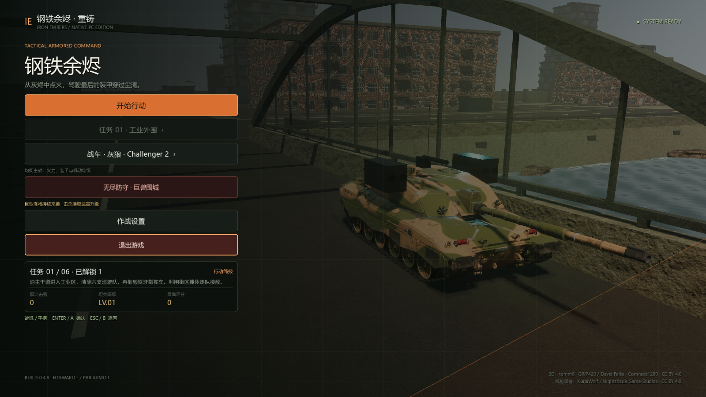
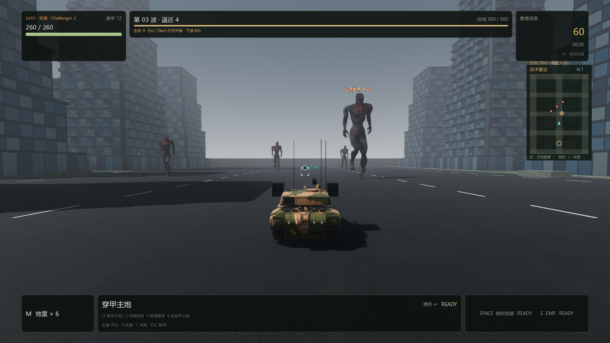
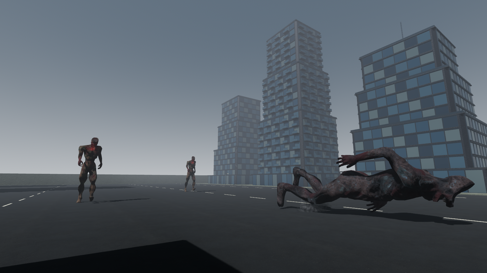
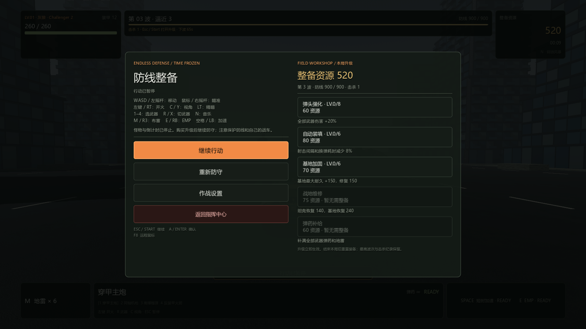

# PC 0.4.8 — 无尽防守 · 巨兽围城

日期：2026-09-11。Godot 4.7.2 / Forward+ / Jolt，Windows x86_64。

## 使用方式与玩法

启动 `outputs/pc-godot/windows-x86_64/IronEmbers.exe`，主菜单选择 **无尽防守 · 巨兽围城**。
默认使用第三人称；C / 手柄 Y 切换俯视，远程桌面按 F8 使用绝对鼠标瞄准。
Esc / Start 暂停战斗并打开整备商店，鼠标或手柄选择升级，继续行动恢复怪物和计时。

- 独立的 220 × 300 米城市防守大道，高层街区、三条宽阔接近路线及实体避难所。
- 开局准备 8 秒，随后每 65 秒进入新波次；上一波未消灭的怪物继续留场。
- 9 米腐化巨尸、12 米暴虐巨尸、16 米灾厄泰坦；每三波排入精英，生命随波次增长，速度缓慢且有上限。
- 怪物走近后蓄力 1.65 秒，再挥击玩家或防线；攻击可以躲开或用 EMP 打断，攻击恢复时间 4.6 秒。
- 头部直接命中造成 1.65 倍伤害；范围爆炸不享受误触发的头部加成。地雷和 EMP 支持怪物。
- 击杀奖励分别为 30 / 55 / 110；开局提供 60 整备资源。奖励只发放一次。
- 弹头强化最高八级，全部武器最高 2.6 倍伤害；装填升级最高六级，间隔最低为原来的 52%。购买不清空当前冷却或凭空恢复弹药。
- 基地加固提高耐久，维修同时修复坦克与防线；可购买全部武器和地雷补给。满血/满弹时相关购买关闭。
- 倒地持续 2.6 秒，保留同一具带纹理模型；尸体约 28 秒淡出，按冻结姿态骨骼范围调整贴地高度。脚步和倒地包含音效、近距离镜头冲击。
- 同时最多 18 个活体、8 具尸体，待生成队列最多 32；入口被玩家占据时尝试其他入口，不在玩家身边突然生成。
- 防线或坦克损毁即结束；最高波次、击杀、生存时间独立保存。重试重置局内资源与升级，战役解锁及等级不受无尽记录影响。

## 素材

下载的模型为 City Building Game Art / HorrorGameMaker.com 发布的
[3D Horror Game Monster](https://opengameart.org/content/3d-horror-game-monster)，许可 CC0 1.0。
保留 3,584 三角面的皮肤网格、70 骨骼、原作 Walk 动作和 2K 皮肤/法线。
三种敌人共用一个原始模型，具有不同尺寸、材质和战斗参数。
攻击与倒地使用 Godot 姿态控制，并非完整物理布娃娃。
来源与校验记录位于 `pc-godot/assets/models/monsters/horror_creature/`，成品 `credits/models/monsters/` 附上许可和来源。

## 验证结果

完整构建回归：**35 组有计数的测试，1590 项通过、0 失败**，另通过 UI 构造冒烟与成品启动验证。
日志：`work/build-pc-0.4.8.log`。已有战役、遥控鼠标、手柄、武器音频、残骸、雨雪、桥梁和山丘检查全部通过。

新增检查：

| 检查 | 结果 | 实际覆盖 |
| --- | ---: | --- |
| 无尽成长 | 106 | 费用、等级上限、实际装填、弹药与冷却保持、存档隔离及旧存档 |
| 无尽 UI | 33 | 主菜单入口、真实手柄 GUI 事件、可购买状态、960×640 滚动与结算 |
| 怪物演员 | 26 | 原作动画实际改变骨骼、材质、弱点、蓄力、EMP、暂停、一次奖励、倒地 |
| 游戏集成 | 93 | 实际移动与基地攻击、真实炮弹/爆炸/地雷、入口阻塞、精英队列、人口与尸体上限、失败、重试及返回战役 |

最终尸体贴地和初始镜头调整后，相关演员 26 项及集成 93 项再次通过。
`work/build-pc-0.4.8-final.log` 为最终重新导出、哈希/归档/元数据与实际 Windows EXE 启动检查。

成品压缩包 `Iron-Embers-Windows-x86_64-0.4.8.zip`：196,583,394 字节。
SHA-256：`a8184ff18252a16daa4d5bb6ad1167c0da4aa900bdcb7552e5aa924521373368`。

GPU 自检使用本机 GTX 1660 SUPER、1600×900、高画质，6 张实际游戏截图，渲染日志无错误。
测试摆放敌人和镜头以检查尺度、动画与界面，战斗和升级使用生产代码；这不是人工长时间通关或完整性能基准。
四只怪物的带 HUD 截图约 29 FPS，仍需在不同显卡和长时间高波次下评估性能。
本机没有实体手柄，手柄操作由实际 Godot 输入事件自动化验证。

## 实际渲染截图

