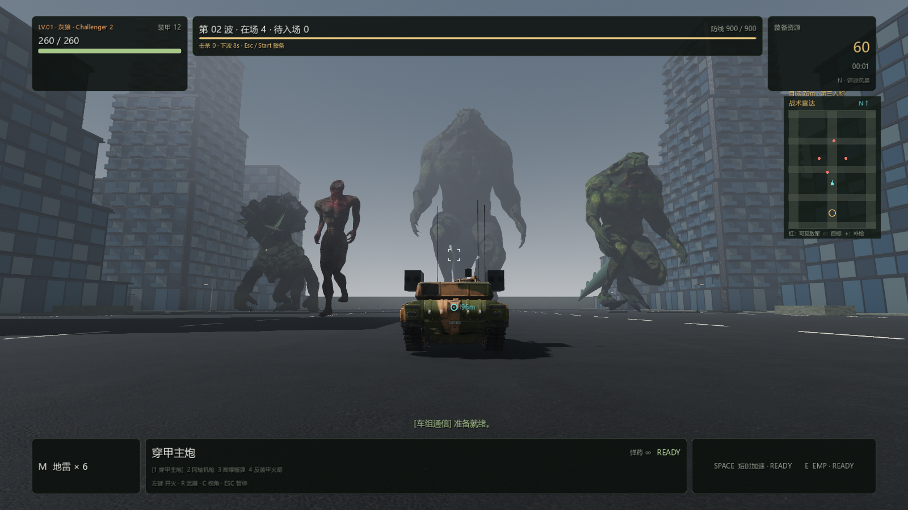
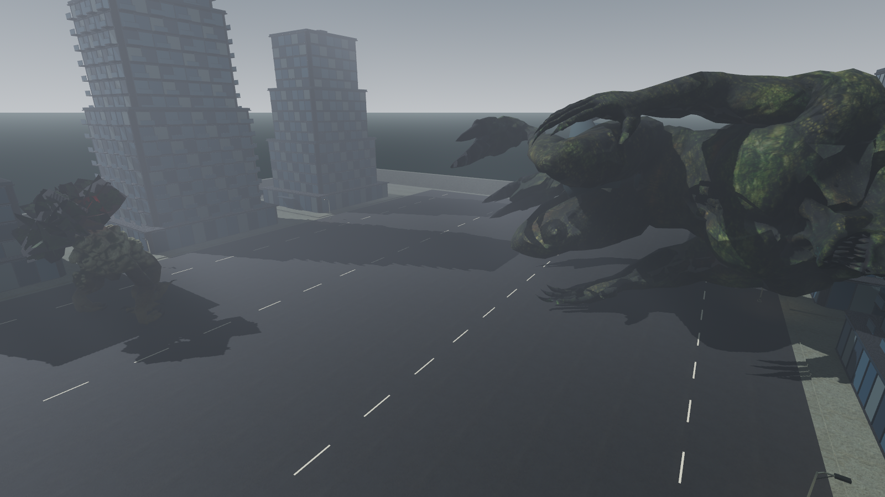

# PC 0.4.9 — 高楼级巨兽与连续波次

## 玩法变化

| 敌人 | 身高 | 基础生命 | 首次出现 |
| --- | ---: | ---: | --- |
| 腐化巨尸 | 14 m | 170 | 第 1 波 |
| 枯林岩魔 | 22 m | 200 | 第 1 波 |
| 暴虐巨尸 | 24 m | 290 | 第 1 波 |
| 裂脊猎兽 | 30 m | 240 | 第 1 波 |
| 灾厄泰坦 | 42 m | 560 | 第 3 波，随后每 3 波 |
| 灭城巨蜥 | 60 m | 680 | 第 2 波，随后每 5 波 |

生命仍随波次增长，移动速度为约 1.15–1.8 m/s 的缓慢接近，后续增长有上限。
现有三套不同的原始骨骼模型、六种游戏角色。新增的岩魔和巨蜥均保留作者
网格、UV、贴图和法线，巨蜥额外增加带骨骼的长尾与背甲，并制作循环行走。
模型来源、具体改动和许可见 [素材署名](../../pc-godot/assets/models/monsters/siege_beasts/CREDITS.md)。

## 第一波后等待问题

旧调度器只按固定 65 秒间隔启动新波次，即使已清场也不提前续波。
待入场队列没有显示，后续出生点又远离玩家，造成清场后长时间看不到后续敌人。
本次改为：

- 本波待生成数量为零且活体为空时，只触发一次清场提示，最多 6 秒后进入下一波。
- 尸体继续倒地、保留和淡出，不参与清场阻塞；暂停商店冻结倒计时。
- 活体已清空但仍有待入场增援时，最多等待 1 秒生成下一名敌人。
- 未清场的波次仍按 65 秒增援，不会无限等待个别卡住的敌人。
- HUD 同时显示在场、待入场、清场状态和下一波倒计时。
- 常规入口从约 z=-96 移到 z=-64，仍检查玩家安全距离、邻近怪物和其他入口。

## 大体型适配

60 米巨兽的胶囊半径为 8.7 米，若继续要求根节点走到避难所门前 3.8 米内，
就会先碰上墙面而无法触发攻击。近战距离现按体型调整，仍检查墙面遮挡、
前摇和命中时玩家距离。新测试实际让巨兽从道路行走到实体避难所并造成伤害。

无尽模式第三人称仰视上限由约 7° 放宽到约 49°；本地鼠标、远程桌面边缘
转向和手柄共享这一控制入口。战役保持原来的摄像机范围。
长尾敌人采用侧倒，较大的身体延长倒地时间；贴地估计仅采集真实皮肤权重引用的
变形骨骼，排除远处的 IK 编辑控制器；全部子网格同时淡出。仍为程序动画，非物理布娃娃。

## 验证

自动化包含原有战役与战斗回归，以及新增的生产调度器连续清场检查。
连续清除五波后自动到达第六波，不直接调用 begin_wave，也不修改波次计时器；
验证本波待入场增援不被跳过、暂停保持时间、六种敌人均实际进入调度、60 米巨兽
的真实道路碰撞与基地攻击、一次性奖励和尸体回收。

实际 Forward+ 渲染检查：第三人称 HUD、三种模型并列、高楼尺度参照和巨兽侧倒。
渲染测试摆放演员与镜头以检查画面，不能替代长时间高波次性能测试。
Windows 原生包通过构建启动检查；Mac 包交叉导出并做结构、权限与双架构签名检查，
当前 Windows 主机无法完成 M4 实机运行验证。

完整回归：**36 组、1616 项通过，0 失败**（`work/build-pc-0.4.9.log`），
另通过 UI 构造冒烟。最终手臂姿态调整后，怪物演员 35 项、连续波次 17 项再次通过
（`work/pc049-giant-final.log`、`work/pc049-waves-final.log`）。
最终 Windows 导出通过结构、哈希、资源版本、归档及实际 EXE 启动检查
（`work/build-pc-0.4.9-final.log`）。

Windows ZIP：225,324,616 字节，SHA-256：
`ce3a95faa4b139338a627d0298951ae2295405e2078f4b25d0b1b2519c1b1653`。

Mac Universal 2 ZIP 已成功导出并通过完整验证（`work/build-macos-0.4.9.log`），
包含原生 ARM64 与 x86_64，SHA-256：
`2a07f40a9a21884d9a5588299c170d3391eb294652abea8936d8546468b4a969`。

最终模型 SHA-256：

- `forest.glb`: `87e501251d53d561048adb9875fa20443123c93b294de62948553427d8dcc8a1`。
- `reptile.glb`: `fba07e4ed2818e0aaeaa509cf3dba4bae096b6ae384c77644ba9eaf37d43c54c`。

