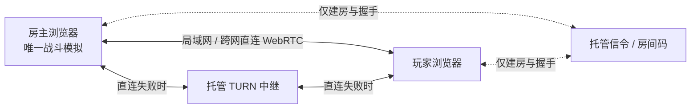

# 网页版房主联机设计

2026-09-23 方案与实施记录。目标是 2–4 人合作对抗敌军：玩家创建房间当房主，朋友输入房间码加入；优先局域网直连，跨网络优先直连，穿透失败再用中继。保留现有单人模式和静态网页入口。

首版已实现网页版房间大厅、WebSocket 信令、WebRTC 双数据通道、房主权威战斗、2–4 辆友军坦克、两张地图、联机专用结算与断线提示。J6412 上的信令进程作为用户服务运行，`127.0.0.1:8787/health` 已验证；临时 Cloudflare Quick Tunnel 的公开 WSS 已在两浏览器建房/加入中实测。[Cloudflare 官方说明](https://developers.cloudflare.com/cloudflare-one/networks/connectors/cloudflare-tunnel/do-more-with-tunnels/trycloudflare/)明确 Quick Tunnel 地址重启会变化且没有可用性承诺，不能当作稳定正式入口。当前只有 STUN 直连，没有 TURN，严格 NAT 下不能保证连通；公网跨运营商、手机实体机、TURN 强制回退和长时间运行尚未验收。2026-09-23 本地两浏览器实际进入同一战场，加入者布雷只扣自己的库存，房主离开会令加入者显示断线。

## 关键边界

GitHub Pages 只能交付静态网页，不能让浏览器凭一个房间码找到另一台浏览器。WebRTC 建连需要交换 offer、answer 和 ICE 候选信息；这一步叫信令。STUN 可帮助发现可用于直连的地址，但不能保证所有 NAT/防火墙都能穿透。对称 NAT、运营商 CGNAT 或严格防火墙下，可靠的兜底是 TURN 转发。**可以不自建常驻游戏服务器，但“房间码 + 任意网络可加入”不能完全没有线上协调服务和中继能力。** [MDN 信令说明](https://developer.mozilla.org/en-US/docs/Web/API/WebRTC_API/Signaling_and_video_calling)、[ICE 标准](https://www.rfc-editor.org/rfc/rfc8445)、[TURN 说明](https://developers.cloudflare.com/realtime/turn/what-is-turn/)。

如果要求真正没有任何线上服务，只能让玩家通过聊天手动交换连接描述与候选信息；这不能提供自动查找房间、稳定跨 NAT 加入。局域网离线自动发现还需要局域网内的辅助程序或服务，不能只靠当前 GitHub Pages 网页完成。

## 当前技术选型与后续部署选项

| 职责 | 方案 | 放置位置 |
| --- | --- | --- |
| 网页、菜单、3D 画面 | 现有 React + Babylon.js + Vite | 继续放在 GitHub Pages |
| 游戏计算 | 房主浏览器独占战斗模拟，客户端只发输入、渲染房主状态 | 玩家设备，不设中心游戏服 |
| 玩家间数据 | 原生 `RTCPeerConnection` + 两条 `RTCDataChannel` | 浏览器间，必要时经 TURN |
| 房间码与握手 | 当前为 J6412 上的 Node/WebSocket 房间目录 | J6412 用户服务，经临时 HTTPS 隧道公开 |
| NAT 穿透 | 当前为 ICE `iceTransportPolicy: 'all'` + STUN | 优先直连；严格 NAT 暂无中继兜底 |
| 稳定入口与 TURN | 待选：固定域名的隧道或公网直连 WSS，加托管 TURN | 不把 TURN 长期密钥放在静态网页中 |

Cloudflare Workers/Durable Objects 及 Realtime TURN 是一套具体可试的托管组合；Durable Object 支持 WebSocket 休眠。TURN 的长期密钥不能放进公开网页，须由 Worker 签发短期凭证。使用额度、价格和国内不同网络的可达性要在实施时实测；信令与 TURN 均保留供应商适配层，不能把供应商 API 写进战斗引擎。[Durable Objects WebSocket](https://developers.cloudflare.com/durable-objects/best-practices/websockets/)、[TURN 凭证](https://developers.cloudflare.com/realtime/turn/generate-credentials/)、[Cloudflare 当前计费说明](https://developers.cloudflare.com/realtime/sfu/platform/pricing/)。

### 局域网优先

两台设备即使共用 Wi-Fi，也先用相同房间码通过信令交换 ICE 候选；房间码服务不承载游戏帧。ICE 会测试本地 `host`、公网映射 `srflx` 和中继 `relay` 等路径；标准建议优先直接路径，但最终使用哪条有效路径由浏览器协商，不能仅凭“同一 Wi-Fi”宣称已经走局域网。保持 `iceTransportPolicy: 'all'`，用 `getStats()` 读取选中的候选对及往返时延，在游戏内显示“局域网直连 / 跨网直连 / 中继”，并在连接失败或 Wi-Fi 切换时执行 ICE restart。路由器 AP 隔离、VLAN、防火墙或浏览器设置可能让局域网直连失败，届时允许自动回退。[ICE 候选优先级](https://www.rfc-editor.org/rfc/rfc8445)、[RTT 统计](https://developer.mozilla.org/en-US/docs/Web/API/RTCIceCandidatePairStats/currentRoundTripTime)。

离线局域网（两台设备都不能访问房间码服务）是单独的增强项：需要本机辅助程序提供发现/信令，或手动交换连接描述，并逐浏览器测试安全上下文与局域网权限。不要把它当作首版房间码联机已实现的能力。

### 信令连接与 J6412 部署

信令不是只发一次请求：每位玩家加入时需要交换 offer、answer 和逐步发现的 ICE 候选；网络切换、重连、ICE restart 时还会再交换。`RTCDataChannel` 建好后，坦克位置、炮弹和战斗事件直接经选中的 WebRTC 路径传送，不经过信令服务器。若房间禁止中途加入且不支持重连，已建立连接后可以关掉信令 WebSocket。首版房间码产品建议保留房主与信令服务之间的轻量连接或低频心跳，用来表示房间仍在线、让新玩家加入并处理重连；这条连接不承载每秒 60 次战斗计算或 10–15 次战斗快照。[WebRTC 会话流程](https://developer.mozilla.org/en-US/docs/Web/API/WebRTC_API/Session_lifetime)、[信令与 ICE 候选交换](https://developer.mozilla.org/en-US/docs/Web/API/WebRTC_API/Signaling_and_video_calling)。

现有 J6412 可以替代上表的托管信令服务来运行小规模房间目录与 WebSocket 服务：Intel 标称 4 核 4 线程、基础频率 2.0 GHz；此角色主要处理建房/加入消息，通常由公网可达性、稳定性和房间滥用防护决定体验，而非由 CPU 决定。实际可承载房间数还取决于这台机器的内存、系统、上行网络和实现，部署后应测连接数、消息率、CPU/内存及断线恢复，不能仅凭 CPU 型号保证容量。[Intel J6412 参数](https://www.intel.com/content/www/us/en/products/sku/214758/intel-celeron-processor-j6412-1-5m-cache-up-to-2-60-ghz/specifications.html)。

如果 J6412 有可从公网访问的地址，可通过 HTTPS/WSS 暴露信令服务。如果 J6412 也在没有公网地址的家庭网络里，Cloudflare Tunnel 可以把本机 WebSocket 服务经其公网入口发布，不要求家庭路由器入站开放端口；稳定的公开地址仍要解决域名/隧道配置。也可以继续使用托管 Worker/Durable Object，省去家用设备在线率对建房的影响。**Cloudflare Tunnel 的 WebSocket 支持不等于可让浏览器通过该隧道访问普通 UDP TURN 服务。** TURN 应另用托管服务；只有 J6412 具备公网可达地址，或有可控的公网 UDP 端口映射时，才考虑在上面部署 coturn 并开放监听端口与中继端口范围。小规模时 J6412 的计算能力不是主要障碍，持续中继的上行带宽和网络路径才需要实测。[Tunnel WebSocket 支持](https://developers.cloudflare.com/cloudflare-one/faq/cloudflare-tunnels-faq/)、[Tunnel 公网路由限制](https://developers.cloudflare.com/tunnel/concepts/routing/)、[coturn 端口配置](https://github.com/coturn/coturn/blob/master/README.turnserver)。

当前机器上的 DuckDNS A/AAAA 会更新到现有公网地址，但路由器管理接口需要登录，公网入站映射和 IPv6 防火墙尚未证实。DuckDNS 更新凭据由 root 私有文件保存；普通 `zcx` 用户无法读取，且无免密 sudo。若要改用 `wss://zcxserver.duckdns.org:9443/ws` 这种固定入口，需先确认路由器 TCP 9443 入站可达，再用 DuckDNS DNS-01 签可信证书并配置 J6412 防火墙；这些条件没有完成前，不应将该地址发布为可用。自建 TURN 还需公网 UDP 3478 与中继 UDP 端口段。现有 WakeWeb 的 8443 端口保持不变。[DuckDNS TXT API](https://www.duckdns.org/spec.jsp)、[Let's Encrypt DNS-01](https://letsencrypt.org/docs/challenge-types/)。

### 房间与安全

当前房主创建房间、选择两张地图之一和人数上限，得到随机房间码与邀请链接；加入者连接房主后，房主锁定准确名单并开始歼灭突击。单独的队友底盘、准备按钮、踢人和重入已锁定房间尚未实现。信令服务只转发限定大小和频率的 SDP/ICE 消息，不接收战斗输入，也不保存长期存档；它限制房间人数、创建频率、消息尺寸和浏览器来源。TURN 临时凭证须在部署中继时另行设计。

WebRTC 数据通道本身使用 DTLS 加密；直连玩家可能获知对方的网络地址，因此界面应说明“优先直连”的隐私含义，另外提供“仅中继”选项（牺牲部分延迟和流量成本）。[MDN 数据通道安全](https://developer.mozilla.org/en-US/docs/Web/API/WebRTC_API/Using_data_channels)、[ICE 地址隐私](https://developer.mozilla.org/en-US/docs/Web/API/RTCIceCandidate/address)。

### 战斗同步

当前采用房主权威的星形拓扑：加入者最多每秒约 30 次发送移动、瞄准、开火状态；房主以固定 60 Hz 步长处理所有玩家、敌军、炮弹、地雷、掉落和胜负，约每 100 ms 发送完整状态快照。旧快照按序号丢弃，远端坦克做短时插值；加入者本车也以房主快照为准，尚无本地预测。输入断流约 200 ms 后，房主自动松开该玩家的持续移动和开火。

实时输入/快照通道使用 `ordered:false, maxRetransmits:0`；房间开始、一次性战斗操作与终局状态走默认可靠有序通道，按序号过滤旧消息。当前每份完整快照在压力测试中约 17 KiB，特效数量有上限；积压时丢弃旧实时快照，不积累延迟。增量快照、二进制编码和弱网带宽测量仍属后续优化。[DataChannel 配置](https://developer.mozilla.org/en-US/docs/Web/API/RTCPeerConnection/createDataChannel)、[缓冲量](https://developer.mozilla.org/en-US/docs/Web/API/RTCDataChannel/bufferedAmount)。

`Battle` 已支持最多四辆友军坦克，各有生命、武器、弹药和技能；`FixedStep.advance()` 接受按玩家 ID 索引的输入，渲染器按本地玩家 ID 跟随镜头。敌人、炮弹、地雷、补给和胜负只由房主计算。房主网页转后台时暂停全房间；ICE 短暂中断会尝试重启，超过重试次数则移出队友或结束加入者连接。当前没有重新加入已开始房间或房主迁移。

首版只开放两张现有地图与“歼灭突击”合作模式，每人独立生命、弹药和技能，团队共用目标与 Boss，友军伤害关闭；死亡玩家观战到本局结束。现有八种玩法在多人输入和目标归属验证后逐步放开。无账号的房主权威只能防止加入者随意改伤害，不能防房主作弊，所以多人局不发放可竞争的排行榜奖励；单机成长存档保持独立。

## 实施顺序与验收

1. **连通性原型**：两浏览器建房/加房，双通道收发，局域网、两种家庭/手机网络、强制 TURN 三种环境均能建立；显示实际选中路径和 RTT。记录国内运营商及手机浏览器结果。
2. **双玩家可玩片段**：仅城市歼灭突击，一名房主、一名加入者；移动、瞄准、开火、敌人、命中、地雷、补给、Boss、结算由房主计算，双方一致。故意丢包、延迟和乱序后不出现重复拾取、双重伤害或持续开火。
3. **扩到四人和野外**：验证浅水、山丘、不同设备帧率与手机触控；测主机 CPU、每人流量、端到端延迟，必要时缩小同屏特效/快照范围。
4. **房间可靠性**：加入前版本检测，掉线重连拿完整快照；房主退房清理房间和 TURN 凭证；网络切换尝试 ICE restart。验证单人模式、两地图、原有存档及网页版部署无回归。

验收标准：局域网能看到选中本地直连候选；不同 NAT 下优先直连且 TURN 测试必通；加入玩家不必有公网 IP；输入/命中/拾取/结算在双方一致；房主断线时有明确提示，不留下持续运行的假房间。
