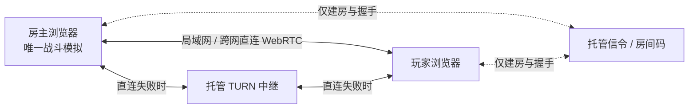

# 网页版房主联机设计

2026-09-23 方案。目标是 2–4 人合作对抗敌军：玩家创建房间当房主，朋友输入房间码加入；优先局域网直连，跨网络优先直连，穿透失败再用中继。保留现有单人模式和静态网页入口。本文是设计，尚未实现联机。

## 关键边界

GitHub Pages 只能交付静态网页，不能让浏览器凭一个房间码找到另一台浏览器。WebRTC 建连需要交换 offer、answer 和 ICE 候选信息；这一步叫信令。STUN 可帮助发现可用于直连的地址，但不能保证所有 NAT/防火墙都能穿透。对称 NAT、运营商 CGNAT 或严格防火墙下，可靠的兜底是 TURN 转发。**可以不自建常驻游戏服务器，但“房间码 + 任意网络可加入”不能完全没有线上协调服务和中继能力。** [MDN 信令说明](https://developer.mozilla.org/en-US/docs/Web/API/WebRTC_API/Signaling_and_video_calling)、[ICE 标准](https://www.rfc-editor.org/rfc/rfc8445)、[TURN 说明](https://developers.cloudflare.com/realtime/turn/what-is-turn/)。

如果要求真正没有任何线上服务，只能让玩家通过聊天手动交换连接描述与候选信息；这不能提供自动查找房间、稳定跨 NAT 加入。局域网离线自动发现还需要局域网内的辅助程序或服务，不能只靠当前 GitHub Pages 网页完成。

## 推荐技术选型

| 职责 | 方案 | 放置位置 |
| --- | --- | --- |
| 网页、菜单、3D 画面 | 现有 React + Babylon.js + Vite | 继续放在 GitHub Pages |
| 游戏计算 | 房主浏览器独占战斗模拟，客户端只发输入、渲染房主状态 | 玩家设备，不设中心游戏服 |
| 玩家间数据 | 原生 `RTCPeerConnection` + 两条 `RTCDataChannel` | 浏览器间，必要时经 TURN |
| 房间码与握手 | 轻量 Worker + 每房间一个 Durable Object，WebSocket 只转发信令并维护等待大厅 | 托管服务，无常驻游戏进程 |
| NAT 穿透 | ICE `iceTransportPolicy: 'all'`，STUN + 托管 TURN | 先直连，失败时中继 |
| TURN 密钥 | Worker 为已加入房间的玩家申请短期凭证 | 长期密钥只留服务端 |

Cloudflare Workers/Durable Objects 及 Realtime TURN 是一套具体可试的托管组合；Durable Object 支持 WebSocket 休眠。TURN 的长期密钥不能放进公开网页，须由 Worker 签发短期凭证。使用额度、价格和国内不同网络的可达性要在实施时实测；信令与 TURN 均保留供应商适配层，不能把供应商 API 写进战斗引擎。[Durable Objects WebSocket](https://developers.cloudflare.com/durable-objects/best-practices/websockets/)、[TURN 凭证](https://developers.cloudflare.com/realtime/turn/generate-credentials/)、[Cloudflare 当前计费说明](https://developers.cloudflare.com/realtime/sfu/platform/pricing/)。

### 局域网优先

两台设备即使共用 Wi-Fi，也先用相同房间码通过信令交换 ICE 候选；房间码服务不承载游戏帧。ICE 会测试本地 `host`、公网映射 `srflx` 和中继 `relay` 等路径；标准建议优先直接路径，但最终使用哪条有效路径由浏览器协商，不能仅凭“同一 Wi-Fi”宣称已经走局域网。保持 `iceTransportPolicy: 'all'`，用 `getStats()` 读取选中的候选对及往返时延，在游戏内显示“局域网直连 / 跨网直连 / 中继”，并在连接失败或 Wi-Fi 切换时执行 ICE restart。路由器 AP 隔离、VLAN、防火墙或浏览器设置可能让局域网直连失败，届时允许自动回退。[ICE 候选优先级](https://www.rfc-editor.org/rfc/rfc8445)、[RTT 统计](https://developer.mozilla.org/en-US/docs/Web/API/RTCIceCandidatePairStats/currentRoundTripTime)。

离线局域网（两台设备都不能访问房间码服务）是单独的增强项：需要本机辅助程序提供发现/信令，或手动交换连接描述，并逐浏览器测试安全上下文与局域网权限。不要把它当作首版房间码联机已实现的能力。

### 房间与安全

房主点“创建房间”，选择地图、玩法、难度和人数上限，得到随机房间码与邀请链接；加入者输入房间码，进入等待大厅，选择底盘并点“准备”。房主确认后开始，同一战斗种子和协议版本发给所有人。房间码应高熵且短期有效；房主令牌与邀请令牌分开，房主可以拒绝/踢出玩家。信令服务只转发限定大小和频率的 SDP/ICE 消息，不接收战斗输入，也不保存长期存档。按房间人数、创建频率、消息尺寸与请求来源限流；TURN 临时凭证须关联有效房间并限制期限。

WebRTC 数据通道本身使用 DTLS 加密；直连玩家可能获知对方的网络地址，因此界面应说明“优先直连”的隐私含义，另外提供“仅中继”选项（牺牲部分延迟和流量成本）。[MDN 数据通道安全](https://developer.mozilla.org/en-US/docs/Web/API/WebRTC_API/Using_data_channels)、[ICE 地址隐私](https://developer.mozilla.org/en-US/docs/Web/API/RTCIceCandidate/address)。

### 战斗同步

采用房主权威的星形拓扑：客户端每秒约 20–30 次发送完整的移动、瞄准、开火状态与单调递增序号；房主以现有固定 60 Hz 步长处理所有玩家、敌军、炮弹、地雷、掉落和胜负，每秒约 10–15 次向每位玩家发包含时刻/序号的状态快照。数值只是初始调参目标，须由实际延迟、丢包和手机耗电测试决定。旧快照直接丢弃，远端坦克插值，本地坦克预测后按房主状态温和校正；输入断流约 200 ms 后房主自动松开开火与移动。

实时输入/快照通道使用 `ordered:false, maxRetransmits:0`；房间准备、开始、拾取确认、升级、结算等关键事件使用默认可靠有序通道，带事件 ID 去重和断线后的完整状态重发。避免把整张地图或大型 JSON 每帧广播，先做增量快照和带宽测量，再决定是否上二进制编码；积压时丢弃旧快照，不积累延迟。[DataChannel 配置](https://developer.mozilla.org/en-US/docs/Web/API/RTCPeerConnection/createDataChannel)、[缓冲量](https://developer.mozilla.org/en-US/docs/Web/API/RTCDataChannel/bufferedAmount)。

现有 `Battle` 只有 `player` 一辆玩家车，`weapon`、`ammo`、`mineAmmo`、`shield`、`kills` 和 `result` 也是单人字段，`FixedStep.advance()` 只接收一份输入；`Renderer3D` 的镜头、特效与可见范围直接读取 `b.player`。不能把单人 `Battle` 在每位玩家浏览器各运行一次来假装同步。改造时把每人生命/武器/弹药/技能/地雷等放进 `PlayerState`，让 `Battle.step()` 接收按玩家 ID 索引的输入；共享任务、敌人、炮弹、掉落由房主掌管。渲染器改为接收与模拟分离的 `BattleView` 和本地玩家 ID。房主视角也走同一份渲染接口，单人模式仍走本地模拟。首版房主网页转后台时暂停全房间；房主连接中断后给短暂重连窗口，超时则结束房间。房主迁移以后再做。

首版只开放两张现有地图与“歼灭突击”合作模式，每人独立生命、弹药和技能，团队共用目标与 Boss，友军伤害关闭；死亡玩家观战到本局结束。现有八种玩法在多人输入和目标归属验证后逐步放开。无账号的房主权威只能防止加入者随意改伤害，不能防房主作弊，所以多人局不发放可竞争的排行榜奖励；单机成长存档保持独立。

## 实施顺序与验收

1. **连通性原型**：两浏览器建房/加房，双通道收发，局域网、两种家庭/手机网络、强制 TURN 三种环境均能建立；显示实际选中路径和 RTT。记录国内运营商及手机浏览器结果。
2. **双玩家可玩片段**：仅城市歼灭突击，一名房主、一名加入者；移动、瞄准、开火、敌人、命中、地雷、补给、Boss、结算由房主计算，双方一致。故意丢包、延迟和乱序后不出现重复拾取、双重伤害或持续开火。
3. **扩到四人和野外**：验证浅水、山丘、不同设备帧率与手机触控；测主机 CPU、每人流量、端到端延迟，必要时缩小同屏特效/快照范围。
4. **房间可靠性**：加入前版本检测，掉线重连拿完整快照；房主退房清理房间和 TURN 凭证；网络切换尝试 ICE restart。验证单人模式、两地图、原有存档及网页版部署无回归。

验收标准：局域网能看到选中本地直连候选；不同 NAT 下优先直连且 TURN 测试必通；加入玩家不必有公网 IP；输入/命中/拾取/结算在双方一致；房主断线时有明确提示，不留下持续运行的假房间。
